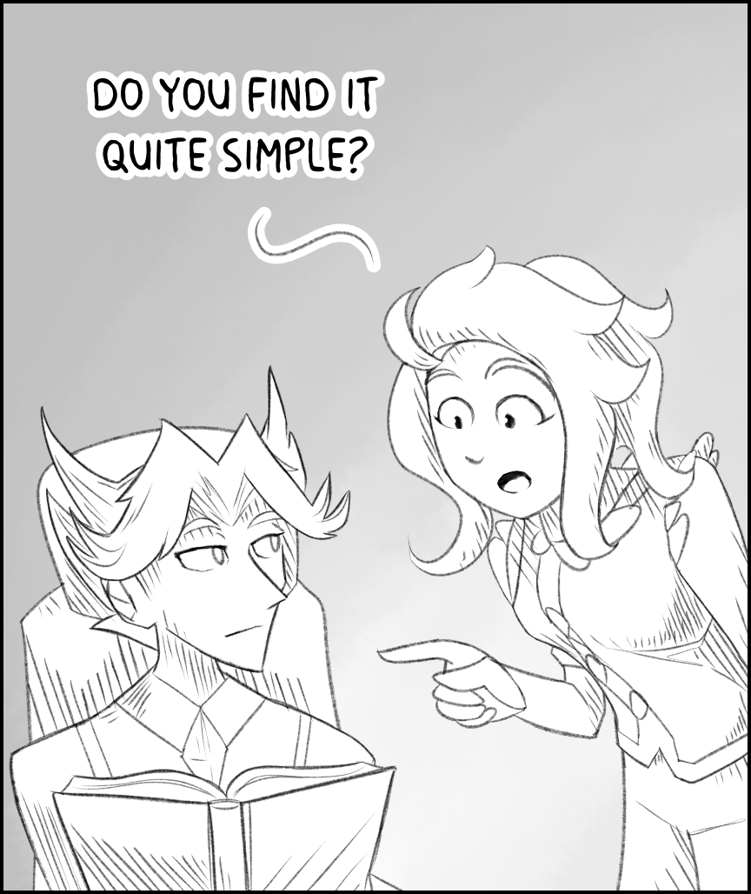

---
tags:
  - 1fcd4sw
  - alis
  - apartment complex
  - cuts
  - comic strip
  - i find it quite simple
  - library
  - newspaper comic
  - nudibranch
  - sea bunny
  - sea hare
  - sea slug
  - solana
  - vicerre
---

# Illustration 066 – Psychological Complex (2024-08-24)

# Illustration 067 – Paper Cut (2024-08-24)

# Illustration 068 – Aquarium Date (2024-08-24)

## Overview

These images depict a set of comics drawn in the style of newspaper comics featuring my core cast.

## Design notes

- Brushes used:
  - Background: Blend > Blend > Wet bleed blender
  - Lineart: Pen > Pencil > Pencil
- Fonts used: [Milk Mustache](https://blambot.com/products/milk-mustache)
- I referenced the comic strips _[Bizarro](https://comicskingdom.com/bizarro)_ and _[The Far Side](https://www.thefarside.com/)_ to determine which aspect ratio (5:6) to use for these comics.

## Resources used

Comic design:

- [Gary Larson The Far Side Daily Comic Strip Original Art dated 1-4-83](https://comics.ha.com/itm/original-comic-art/comic-strip-art/-/a/7013-94048.s)
- [The Mystery of Comic Strip Sizes](http://rodmckie.blogspot.com/2008/02/mystery-of-comic-strip-sizes.html)

Inspirations:

- [New triangle alignment chart](https://www.reddit.com/comments/qpxudo/)
- [Where Do You work Out?](https://knowyourmeme.com/memes/where-do-you-work-out)
- [委托！](https://twitter.com/lacunarsplatoon/status/1821526774381158687)

Other:

- [Sea slug recipes](http://www.seaslugforum.net/find/recipe)
