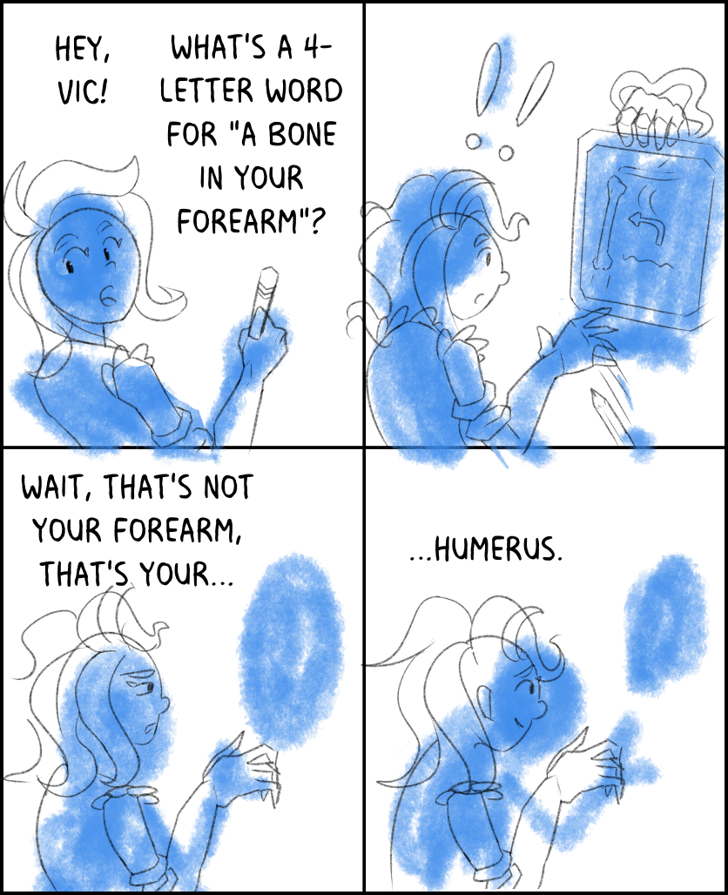

---
humorous:
  - humorous
  - humerus
tags:
  - bad puns
  - crossword
  - forearm
  - sketch
  - solana
  - ulna
---

# Illustration 069 – Crossword Solving (2024-08-25 – 2024-08-26)

## Overview

A four-panel newspaper-style comic strip in which Solana solves a crossword clue.

## Design notes

- As the punchline of the comic matters more than image quality, I opted to leave comic in sketch form instead of rendering it fully.
- In determining which aspect ratio to use for each panel, I referred to [the submission guidelines for King Features](https://kingfeatures.com/contact-us-submission-guidelines/). A comic strip 6.5" wide by 2" tall has an aspect ratio of 13:4. Divided into four panels, each panel should receive an aspect ratio of 13:16, which I have applied in this image. From here, I stacked the first two panels on top of the last two panels for readability on the web.
