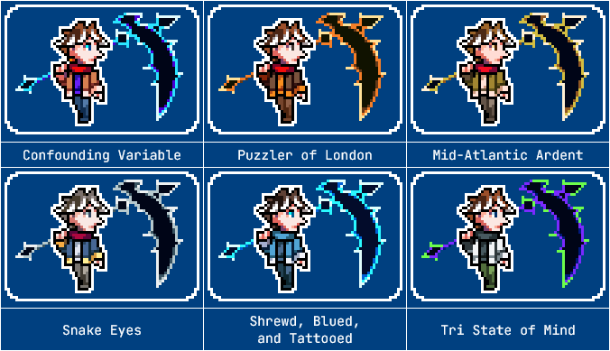

---
tags:
  - palette swap
  - pixel art
  - vicerre
---

# Rendition 069 – Fighting Game Palettes (2024-08-30)

## Overview

A collection of palette swaps for Vic.

These palettes take inspiration from characters with similar tropes to Vic, which I will explain below.

## Explanation

| Name                        | Reference                                           | Name Inspiration                                                                                                                                               | Similar Tropes                                                | References Used                                                                      |
| --------------------------- | --------------------------------------------------- | -------------------------------------------------------------------------------------------------------------------------------------------------------------- | ------------------------------------------------------------- | ------------------------------------------------------------------------------------ |
| Confounding Variable        | (default)                                           | [confounding variable](https://en.wikipedia.org/wiki/Confounding) + puzzling nature                                                                            |                                                               |                                                                                      |
| Puzzler of London           | Herschel Layton (Professor Layton series)           | puzzler + ["Tower of London"](https://en.wikipedia.org/wiki/Tower_of_London)                                                                                   | geometric, professorial, puzzles, simple                      |
| Mid-Atlantic Ardent         | Milo Thatch (_Atlantis: The Lost Empire_)           | "ardent" + "Atlantic" (as in "of Atlantis") + ["Mid-Atlantic accent"](https://en.wikipedia.org/wiki/Mid-Atlantic_accent)                                       | academic, concave, dorky, lanky                               | [1](https://www.youtube.com/watch?v=YQwwDhTE3kY)                                     |
| Snake Eyes                  | Snake (_999: Nine Hours, Nine Persons, Nine Doors_) | [snake eyes](https://en.wiktionary.org/wiki/snake_eyes)                                                                                                        | disheveled hair, intellectual, lanky, library                 |
| Shrewd, Blued, and Tattooed | Jace Beleren (_Magic: The Gathering_)               | [Blue (MTG)](https://mtg.fandom.com/wiki/Blue) + Jace's tattoos + ["screwed, blued, and tattooed"](https://en.wiktionary.org/wiki/screwed,_blued_and_tattooed) | amnesia, fox (Bloomburrow), intelligence, memory manipulation | [1](https://mtg.fandom.com/wiki/Jace_Beleren?so=search&file=Jace%2C_Mirror_Mage.jpg) |
| Tri State of Mind           | Heinz Doofenshmirtz (_Phineas and Ferb_)            | ["NY State of Mind"](https://en.wikipedia.org/wiki/N.Y._State_of_Mind) + "tri-state area"                                                                      | eccentric, inventions, nose, science, scruffy hair            |

## Scrapped ideas

| Character                                                  | Similar Tropes                 | Dissimilar Tropes |
| ---------------------------------------------------------- | ------------------------------ | ----------------- |
| Baizhu (_Genshin Impact_)                                  | scientific, suspicious         | bishonen          |
| Brassius (_Pokémon Scarlet and Violet_)                    | depressive, disheveled         | dark              |
| Canabela (_Ghost Trick_)                                   | lanky, quirky, red scarf       | funky             |
| Cave Johnson (_Portal 2_)                                  | eccentric, scientific          | corporate         |
| Elliott (_Stardew Valley_)                                 | angular, artistic, romantic    | not scientific    |
| Franken Stein (_Soul Eater_)                               | creepy, mad, scientific        | dark              |
| Holden Ford (_Mindhunter_)                                 | intelligent, unsettling        | dark              |
| Izuru Kamukura (_Danganronpa 2: Goodbye Despair_)          | competent, split personality   | dark              |
| Newt Scamander (_Fantastic Beasts and Where to Find Them_) | awkward, savant, scruffy hair  | not scientific    |
| Rick Sanchez (_Rick and Morty_)                            | abrasive, intelligent, portals | dark, gross       |
| Sherlock Holmes (_Sherlock_)                               | abrasive, intelligent          | dark              |
| Willy Wonka (_Charlie and the Chocolate Factory_)          | eccentric, scruffy hair        | not serious       |

## Resources used

- [HTML Cleaner Tool](https://htmlcsscleaner.com/)
- [Nearest words](http://hakank.org/nearest_words/index.html)

## WIPs

- [1](https://cdn.discordapp.com/attachments/1208868988851847168/1279272707732672543/image.png)
