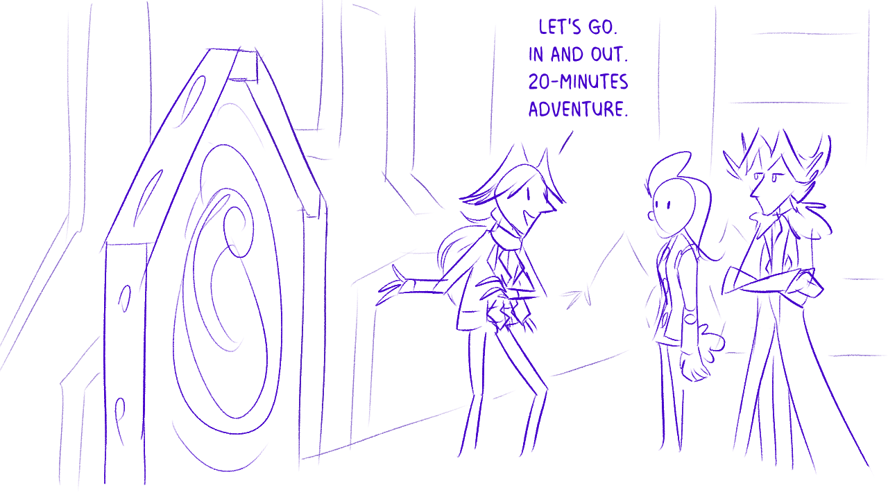
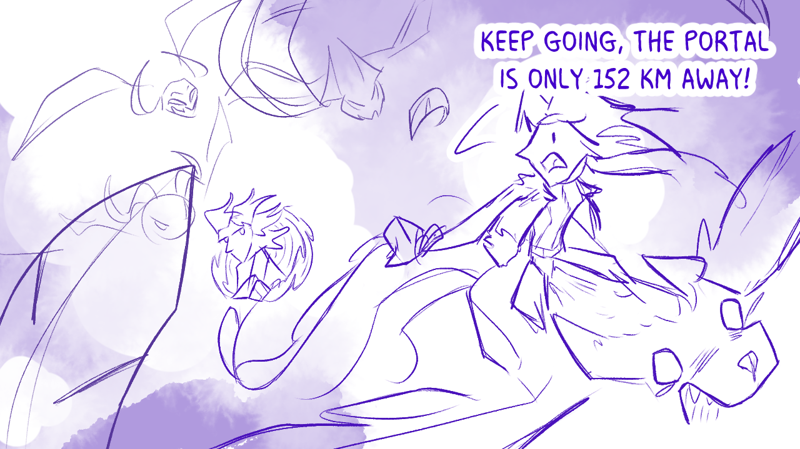

---
tags:
  - alis
  - jummin
  - Rick and Morty
  - solana
  - vicerre
---

# Icebreaker 148

> Which cartoons, video games, TV shows, anime, or any kind of media would your characters best fit into? ([2024-09-01](https://discord.com/channels/448538687983321098/1020875112045613217/1279704356748529707), Kiwi)

Initially, I couldn't come up with any works of media that were a direct match for my own. Thus, I approached this prompt an analytical angle, where I described the significant elements of my work and looked for the best match.

Elements in my work:

- Brainteasers, puzzles, and riddles
- Character-driven narrative
- Callbacks and foreshadowing
- DS-era graphics
- Dumb puns
- Impenetrable continuity
- Magical creatures (legacy)
- Magical realism
- Magic as a science
- Modern, urban setting
- Noughties anime hair
- Slice of life

Elements not in my work:

- Gratuitous fanservice
- Gratuitous violence
- Lengthy plot arcs (as of this year)
- Technobabble
- Whedonisms

With these elements in mind, the titles of Shu Takumi come to mind.

## Bonus sketch

Assuming my characters are able to travel to other continuities using Vic's interdimensional portal:

## Bonus sketch

200 hours later:

## Resources used

- [20 Minutes Adventure](https://knowyourmeme.com/memes/20-minutes-adventure)

## WIPs

- [1](https://cdn.discordapp.com/attachments/1020875112045613217/1279788142358036544/image.png)
- [2](https://cdn.discordapp.com/attachments/1020875112045613217/1279815450968064011/image.png)
