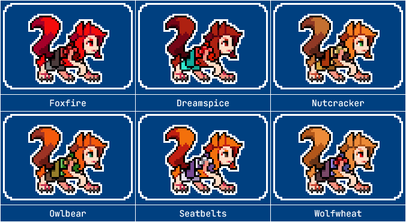

---
humorous:
  - warrior cats naming convention
tags:
  - compound words
  - palette swap
  - pixel art
  - solana
---

# Rendition 071 – Fighting Game Palettes (2024-09-03)

## Overview

A collection of palette swaps for Solana.

These palettes take inspiration from characters with similar tropes to Solana, which I will explain below.

## Explanation

| Name       | Reference                                         | Similar Tropes                    | References Used                                  |
| ---------- | ------------------------------------------------- | --------------------------------- | ------------------------------------------------ |
| Foxfire    | (default)                                         |                                   |                                                  |
| Dreamspice | Paprika (_Paprika_)                               | alter ego, dreams, perky, redhead | [1](https://www.slashfilm.com/1589701/)          |
| Nutcracker | Squirrel Girl (_The Unbeatable Squirrel Girl_)    | fluffy tail, perky, pop culture   | [1](https://www.amazon.com/-/dp/1302920456)      |
| Owlbear    | Doric (_Dungeons & Dragons: Honor Among Thieves_) | natural, redhead, shapeshifter    |                                                  |
| Seatbelts  | Valerie Frizzle (_The Magic School Bus_)          | perky, redhead, science           | [1](https://www.youtube.com/watch?v=v53mhRXXT2g) |
| Wolfwheat  | Holo (_Spice and Wolf_)                           | beastly, natural, shapeshifter    |                                                  |

## Scrapped ideas

| Character                                   | Similar Tropes                       | Dissimilar Tropes           |
| ------------------------------------------- | ------------------------------------ | --------------------------- |
| Axel (_Kingdom Hearts_)                     | anime hair, readhead                 | anti-villain, lanky         |
| Ceroba (_Undertale Yellow_)                 | kitsune                              | grace                       |
| Mebh (_Wolfwalkers_)                        | natural, redhead, shapeshifter       | youth                       |
| Mia (_Death Vigil_)                         | cute, monstrous, shapeshifter        | deathly                     |
| Miss Fortune (_Skullgirls_)                 | animalistic, disconnected body parts | confidence, puns            |
| Nia Teppelin (_Tengen Toppa Gurren Lagann_) | cool, cute, love interest            | not natural, not scientific |
| Naruto Uzumaki (_Naruto_)                   | anime/manga, kitsune                 | energetic, kitsune ally     |
| Penny (_Stardew Valley_)                    | gentle, redhead                      | exploited                   |
| Yuki (_Wolf Children_)                      | animalistic, natural, shapeshifter   | youth                       |
| Zoologist (_Terraria_)                      | kitsune, natural, shapeshifter       | ditsy, not scientific       |

<!-- Velnna? https://twitter.com/Velnna/status/1581021989107806208 -->

## WIPs

- [1](https://cdn.discordapp.com/attachments/1208868988851847168/1280752981725413418/image.png)
