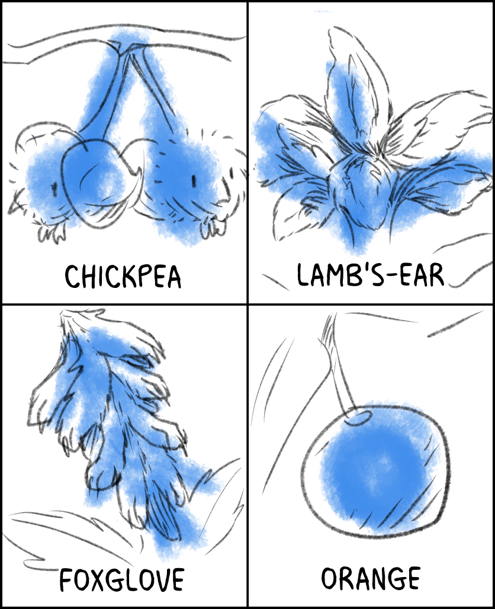

---
humorous:
  - Codex Seraphinianus
  - give chickpeas a chance
  - Vegetable Lamb of Tartary
tags:
  - bad puns
  - chickpea
  - foxglove
  - lamb's-ear
  - orange
  - sketch
---

# Illustration 070 – Botany (2024-09-05)

## Overview

[Vic has recently been shown to tend to a grove.](2024-08-11_vignette-078_more-amends.md)
Knowing this, it's only natural he would bring his sense of wordplay and fascination with hybrid creatures into the plant kingdom.

## Resources used

- [Jace, Alone](https://magic.wizards.com/en/news/magic-story/jace-alone-2017-09-06)
- [Vegan Witches](https://www.reddit.com/comments/17gkeg5/)
