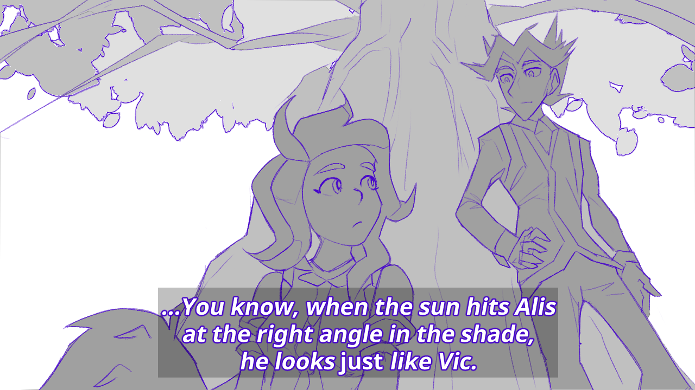

---
humorous:
  - Delicious in Dungeon
  - Dungeon Meshi
tags:
  - alis
  - low-angle shot
  - solana
  - worm's eye view
---

# Illustration 071 – Light Angle (2024-09-07)

## Overview

I sometimes forget Alis is meant to resemble Vic, to the point where I become genuinely surprised when he does.

## Design notes

- Given some recent inspirations from an anime I watched, this image is designed as a mock storyboarding frame.
- I attempted a low-angle shot for this drawing, and I think it turned out well.
- Font used: [Noto Sans](https://fonts.google.com/noto/specimen/Noto+Sans)

## WIPs

- [1](https://cdn.discordapp.com/attachments/1020875112045613217/1282158236845346866/image.png)

## Bonus material

- [Textless alt](assets/2024-09-07_image-216.png)
