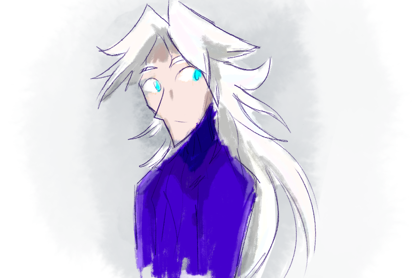

---
tags:
  - alis
  - solana
  - undyed
  - vicerre
---

# Icebreaker 149

> What do your characters' hair actually look like _before_ you, the artist, help them fix it up? ([2024-09-06](https://discord.com/channels/448538687983321098/1020875112045613217/1281582007452962938), Kiwi)

Vic's hair, untied and undyed:

## WIPs

- [1](https://cdn.discordapp.com/attachments/1020875112045613217/1281592217558847539/image.png)

# Icebreaker 150

> Where do you see your characters in ten years? ([2024-09-08](https://discord.com/channels/448538687983321098/1020875112045613217/1282215727922942016), Kiwi)

- Alis: "To what extent does Alis control his own fate?" is one of Alis's driving questions, so the answer to this prompt is one he would like to define. As of writing, Alis has founded his own lab and has gathered his thoughts, so he is on a similar trajectory to Vic's. Furthermore, by way of Vic's universe, he has a glimpse into future history, which may or may not be helpful in directing his fate.
- Solana: She might drift away to do her own thing. She might crash-and-burn and end up reincarnating. The universe might just be in shreds in ten years time, taking her with it. There's a lot that can go wrong from now until ten years from now! She doesn't think about what life would be like in ten years when it's much more enjoyable to live in the present.
- Vic: If you asked Vic where he would be in ten years ten years ago, he wouldn't be able to offer a realistic response. His life is defined by the moments that came into his life unexpectedly. Solana's presence inexorably changed the course of his life. The same goes with Alis's, and the same goes for the Storyteller's. To him, the course of one's future seems to be defined the people who enter it.

# Icebreaker 151

> How hard would it be to contain your characters? I.e. could they escape an ordinary locked room? What about a prison full of armed guards? What is their limit? Bonus points if you give them an [SCP class](https://scp-wiki.wikidot.com/object-classes). ([2024-09-09](https://discord.com/channels/448538687983321098/1020875112045613217/1282749203864485890))

[hypothetical]

Alis:

- Somewhat paradoxically, Alis has an easier time escaping a cell in a high-security prison than he does a simple locked room. Being able to scan the minds of those who compose the prison's security system gives him ample insight into the elements essential to his escape.
- If confined to a simple locked room, Alis takes a deconstructive approach to escaping. He knocks loose the pins holding the door's hinges (or the equivalent thereof, for doors without hinges). If presented with a more esoteric security system, he studies and deconstructs that.
- Instead of making his escape more _complex_, it's better to make his escape more _exhausting_. For instance, you could confine Alis by exiling him to an island in the middle of nowhere.

Solana:

- Solana's fireballs pack some punch, so given a locked room, she uses them to break the room open (though not without expressing regret for the damage caused). Alternatively, she morphs into a fox of dire size and strains the door far beyond its load capacity.
- Solana is quickly outnumbered when trying to escape a well-fortified prison.
- Solana could be contained by placing her in a sturdy iron cage with very fine gaps. She can't slip out, as she can't morph into something as small as a worm. She can't break the bars, as she's only as tough as any other fantasy boss monster.

Vic:

- Vic's portals can open wherever a needle can travel. Given a locked room, he casts and slips a portal through the gap underneath the door.
- Vic isn't a combative sort. He can determine an escape route in a high-security prison, but he would be downed by one of the people guarding the facility before too long.
- I always imagine "a sealed bank vault" as a threshold for Vic's portal abilities, so it's not a horrible idea to use one to confine him. <!-- Even if he can't use his portals, Vic's ice abilities would theoretically give him a chance of escape in such a location. As of writing, though, they aren't very effective in a scenario like this. -->
