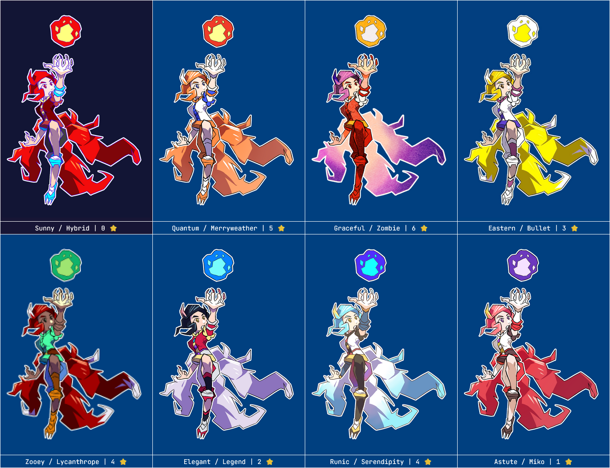

---
tags:
  - fireball
  - foxgirl
  - kitsune
  - palette swap
  - pixel art
  - solana
---

# Rendition 072 – Fighting Game Palettes (2024-09-19 – 2024-09-20)

## Overview

A collection of palette swaps for Solana.

These palettes take inspiration from characters with similar tropes to Solana, which I will explain below.

## Explanation

Overall, the characters selected have the following attributes:

- They are female.
- They have fox traits.
- They are _kemonomimi_ (not anthropomorphic or simply fox-themed).
- They are an adult.
- They are mature.
- They are not villainous.
- They are not from a live-action work.
- They are not from a work where animal folk are the norm.

| Name                   | Reference                                   | Name Inspiration                                                                                                                  | References Used                                                                                                                                  |
| ---------------------- | ------------------------------------------- | --------------------------------------------------------------------------------------------------------------------------------- | ------------------------------------------------------------------------------------------------------------------------------------------------ |
| Sunny / Hybrid         | (default)                                   | ["sol"](https://en.wikipedia.org/wiki/Sun) theming + character lore                                                               |                                                                                                                                                  |
| Quantum / Merryweather | Mozilla Firefox (_Internet Explorer_)       | [Firefox Quantum](<https://en.wikipedia.org/wiki/Quantum_(Mozilla)>) + [Merryweatherey Media](https://twitter.com/Merryweatherey) | [1](https://www.webtoons.com/en/canvas/internet-explorer/ep-26-firefox-meets-naenara/viewer?title_no=219164&episode_no=38)                       |
| Graceful / Zombie      | Dakki, the Graceful Mayakashi (_Yu-Gi-Oh!_) | card name + card type                                                                                                             | [1](<https://yugipedia.com/wiki/Dakki,_the_Graceful_Mayakashi_(Master_Duel)>)                                                                    |
| Eastern / Bullet       | Ran Yakumo (_Touhou_)                       | ["東方"](https://en.wiktionary.org/wiki/%E6%9D%B1%E6%96%B9) + game genre (bullet hell)                                            | [1](https://en.touhouwiki.net/wiki/Ran_Yakumo)                                                                                                   |
| Zooey / Lycanthorpe    | Zoologist (_Terraria_)                      | character title + [in-game bestiary](https://terraria.wiki.gg/wiki/Bestiary) entry                                                |
| Elegant / Legend       | Ahri (_League of Legends_)                  | ["아리"](https://leagueoflegends.fandom.com/wiki/Ahri/Trivia) + game name                                                         | [1](https://leagueoflegends.fandom.com/wiki/Ahri/LoL)                                                                                            |
| Runic / Serendipity    | Misasagi (_Rune Factory 5_)                 | game name + shop name                                                                                                             | [1](https://www.reddit.com/comments/txmu1p/), [2](https://www.youtube.com/watch?v=dOyVGgh3mq4), [3](https://www.youtube.com/watch?v=TY5-Nzt0N-w) |
| Astute / Miko          | Yae Miko (_Genshin Impact_)                 | "Astute Amusement" (character title) + character role                                                                             | [1](https://genshin-impact.fandom.com/wiki/Yae_Miko/Gallery)                                                                                     |

<!-- | Crunchy / Streamer     | Crunchyroll-Hime                            | service name + character role                                                                                                     | [1](https://www.crunchyroll.com/news/features/2018/6/6/the-origin-of-crunchyroll-hime)                                     | -->

## Design notes

- I had eight palettes to create, so I did not prioritize the quality of the base art. Instead, I quickly drew Solana in an angular art style.
- These palettes are sorted chromatically by the color of the character's fireball.
- New to this set, each character is given a rating. This rating is on a scale from zero to five [sic], indicating how difficult the character is to identify online.
- Each palette name is divided into two words, an adjective and a noun. The adjective is revealed first and acts as a small hint. The noun is revealed second and acts as a large hint.

## Resources used

- [Fox Tail – Zerochan Anime Image Board](https://www.zerochan.net/Fox+Tail)
- [JPEG Artifact Generator](https://impliedchaos.github.io/artifactor.html)
- [Kyle's Very Nice Paper Layer (Dark)](https://kyletwebster.gumroad.com/l/ZHvXw)
- [PiXel ScaLer](https://irokaru.github.io/pixel-scaler/)

## WIPs

- [1](https://cdn.discordapp.com/attachments/1284999109240946720/1286419029774438400/image.png)
- [2](https://cdn.discordapp.com/attachments/1088807963042521099/1286429504583237694/image.png)
- [3](https://cdn.discordapp.com/attachments/1284999109240946720/1286650586640551936/image.png)
- [4](https://cdn.discordapp.com/attachments/1284999109240946720/1286667766010744903/image.png)
- [5](https://cdn.discordapp.com/attachments/1284999109240946720/1286696869413650475/image.png)
