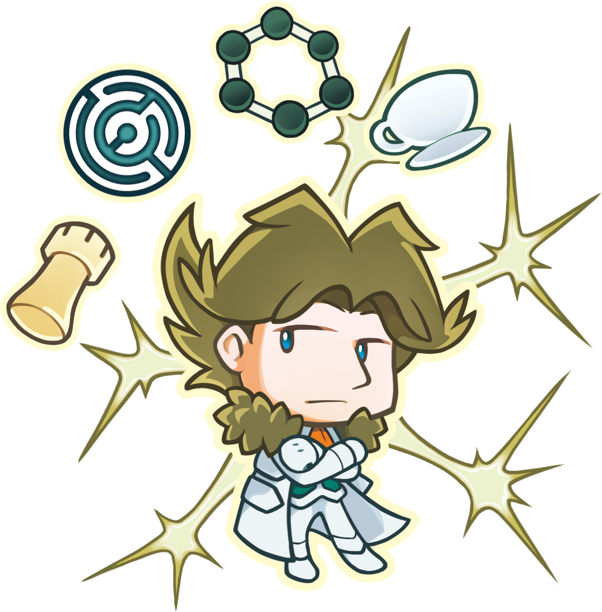
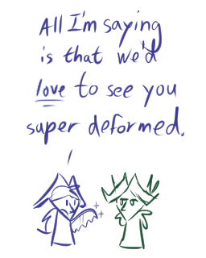

---
humorous:
  - pretentious bastard
tags:
  - alis
  - chibi
---

# Rendition 075 – Alis Chibi (2024-09-30 – 2024-10-05)

## Overview

A chibi-style graphic featuring Alis and Alis accessories.

This image is drawn in the CMYK color space.

## Design notes

The accessories around Alis represent his personal attributes. Clockwise from bottom left, the accessories and their meanings are as follows:

| Accessory     | Meaning                   |
| ------------- | ------------------------- |
| chess piece   | affinity for chess        |
| circular maze | labyrinthine nature       |
| arene         | affinity for neuroscience |
| teacup        | affinity for tea          |

In addition, the background represents Alis's association with neurons.

## Resources used

- [circular labyrinth icon metallic blue](https://www.craiyon.com/image/JI3uj2E_T6y4gR9D28KRuw)
- [CPK coloring](https://en.wikipedia.org/wiki/CPK_coloring)
- [Haikyuu Gummy Gacha vol. 1 [PRE-ORDER]](https://www.pinterest.com/pin/155303888159656550/)
- [(`･∀･)](https://x.com/i/web/status/603871599788478464)
- [덩숲](https://danbooru.donmai.us/posts/8108781)

## WIPs

- [1](https://cdn.discordapp.com/attachments/1208868988851847168/1291013888959053844/image.png)
- [2](https://cdn.discordapp.com/attachments/1208868988851847168/1291916551083266080/image.png)
- [3](https://cdn.discordapp.com/attachments/1208868988851847168/1292294294396211274/2024-09-30_image-222.png)

## Bonus sketch

