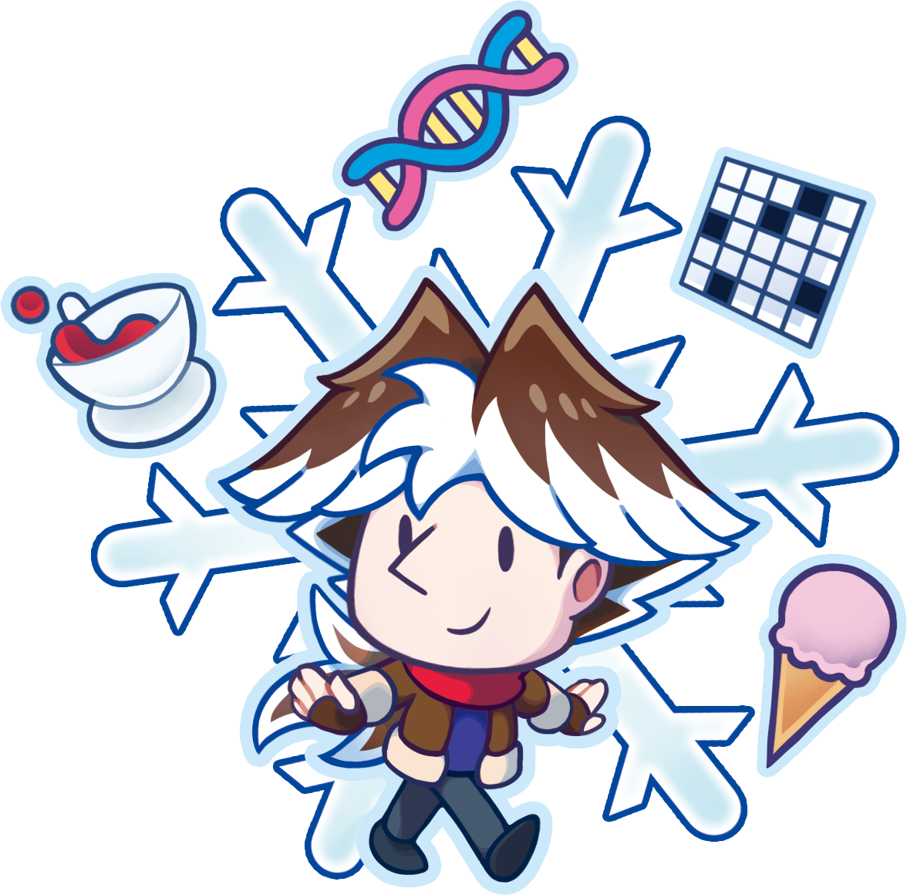

---
tags:
  - chibi
  - vicerre
---

# Rendition 076 – Vicerre Chibi (2024-10-06 – 2024-10-11)

## Overview

A chibi-style graphic featuring Vic and Vic accessories.

This image is drawn in the CMYK color space.

## Design notes

The accessories around Vic represent his personal attributes. Clockwise from bottom left, the accessories and their meanings are as follows:

| Accessory      | Meaning                     |
| -------------- | --------------------------- |
| teacup         | affinity for tea            |
| DNA fragment   | affinity for bioengineering |
| crossword grid | affinity for puzzles        |
| ice cream      | affinity for sweets         |

In addition, the background represents Vic's association with ice.

## Resources used

- [Cute Sorcerers 1.5 inch Phone Charms – Glitter or Plain](https://www.etsy.com/listing/1594192908/)
- [1](assets/2024-09-08_image-221.png)

## WIPs

- [1](https://cdn.discordapp.com/attachments/1208868988851847168/1292630122406346752/image.png)
- [2](https://cdn.discordapp.com/attachments/1208868988851847168/1293366161811050588/image.png)
- [3](https://cdn.discordapp.com/attachments/1208868988851847168/1294349246375657492/2024-10-06_image-224.png)
