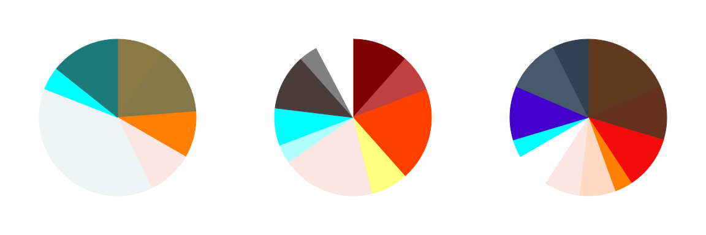

---
tags:
  - color distribution
  - color palette
  - color scheme
---

# Meta 032 – Character Design Color Distribution

## Overview

Color distribution breakdowns of my characters, visualized as pie charts.

## Design notes

- I used a Fibonacci-based weight system to determine the size of each slice.
- The colors in each pie chart are roughly ordered by hue + vibrance.

## Resources used

- [Color theme from image | Adobe Color](https://color.adobe.com/create/image)
- [Dota 2 Workshop – Character Art Guide](https://help.steampowered.com/en/faqs/view/0688-7692-4D5A-1935)
- [Great tool for generating colour palettes – colormind.io](https://www.reddit.com/comments/h9bjjm/) (unused)
- [Last night I wrote a Processing script that generates a pie chart representing the color palettes of Pokémon. Here are the results.](https://www.reddit.com/comments/2ey1pw/)
- [Pie Chart Maker](https://virtualscienceteachers.org/pie-chart-maker/)
