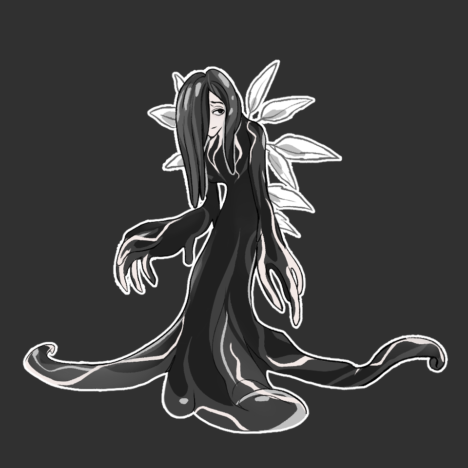
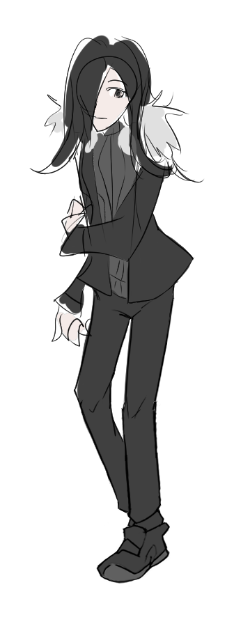

---
humorous:
  - panache
tags:
  - concept art
  - inkbound
  - storyteller
---

# Illustration 072 – Storyteller Design (2024-10-12 – 2024-10-13)

## Overview

An updated design of the Storyteller. This design is not finalized.

## Design notes

- The Storyteller's design is fluid—the form depicted in this post is not the only form she may take.
- Compared to [the last time I drew it](../2023-q4/2023-11-26_illustration-035_character-sheet.md), the Storyteller's design has evolved. Most notably, she is now drawn with one eye visible, whereas she was previously drawn without visible eyes.
- This form draws inspiration from the following themes:
  - angelic motifs
  - black ink and quill pens
  - Lovecraftian motifs
- Strictly speaking, the Storyteller uses no ink when writing. However, ink is more romantic than any motif associated with typing, so I used it in creating this design.
- Inspired by [Shion Yorigami](https://en.touhouwiki.net/wiki/Shion_Yorigami), I considered adding pieces of paper to her design. In practice, however, drawing the Storyteller with paper attached to her made her look [tarred and feathered](https://en.wikipedia.org/wiki/Tarring_and_feathering). Furthermore, drawing small pieces of paper over her design was time-consuming. Thus, I opted not to incorporate paper into her design.
- Alis, Solana, and Vic are associated with the colors green/red/blue ([in RGB](https://en.wikipedia.org/wiki/RGB_color_model)) and yellow/magenta/cyan ([in CMYK](https://en.wikipedia.org/wiki/CMYK_color_model)). The Storyteller's color scheme complements these characters by acting as the [key](https://en.wikipedia.org/wiki/Key_plate) to them.
- In an alternate form, the Storyteller adopts clothing elements from Alis, Solana, and Vic.

## Miscellaneous notes

- The Storyteller's forms have names.
  - The form depicted in this post is referred to as her Inkbound Form.
  - The other form depicted in this post is referred to her Coalesced Form.
  - Other names considered for her Coalesced Form include: Coagulated/Cohered/Collected/Composite/Congealed/Consolidated/Gestalt/Incarnate/Manifest/Precipitate/Solidified

## Inspirations

- [Brushogun](https://teentitans.fandom.com/wiki/Brushogun) (Teen Titans)

## WIPs

- [1](https://media.discordapp.net/attachments/1208868988851847168/1294851381399650324/image.png)
- [2](https://cdn.discordapp.com/attachments/1284999109240946720/1294851581505699974/image.png)
- [3](https://cdn.discordapp.com/attachments/1208868988851847168/1295052434149998655/image.png)

## Bonus sketch

