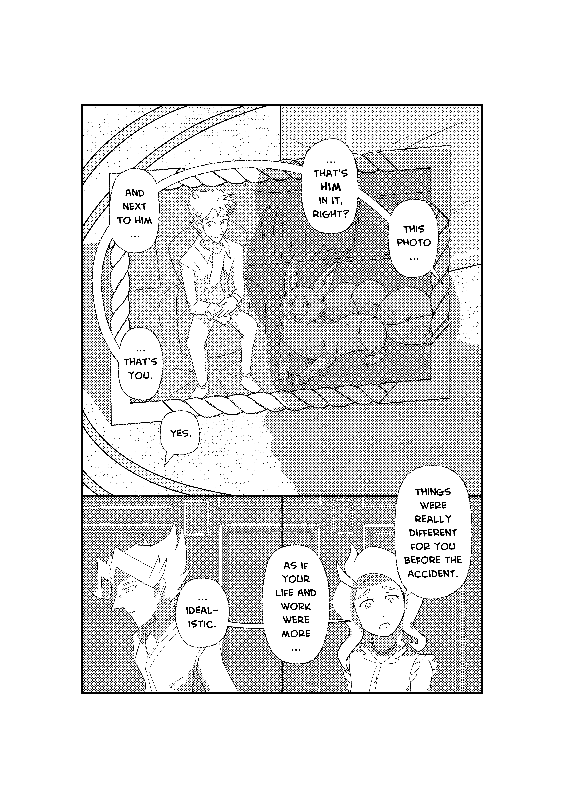

---
humorous:
  - Harleen
tags:
  - alis
  - armin
  - manga
  - solana
---

# Illustration 073 – Another Time, Another Place (2024-11-14 – 2024-11-17)

## Overview

A manga-style illustration depicting Alis sharing his past with his universe's Armin to Solana.

## Design notes

- This image may be motivated by current life events.
- In composing this page, I applied the following artistic effects:
  - In the main panel, the curvature of the cables in the background matches the curvature of Solana's speech balloons.
  - The dark shadow Solana casts over Armin's picture mirrors Armin's absence.

## Resources used

Brushes used:

- [dual brush texturizer I](https://assets.clip-studio.com/en-us/detail?id=1951649)
- Filter > Effect > Pencil drawing...
  - Hatching size: 8
  - Hatching roughness: 5
  - Hatching angle: 0
- [Twist Straps and rope brushes (ねじれ紐と縄ブラシ)](https://assets.clip-studio.com/en-us/detail?id=1618084)

References used:

- [People, lifestyle, business, style, fashion and men's wear concept. Positive successful young CEO sitting in armchair, smiling at camera, dressed in elegant shoes, trousers, jacket and white t-shirt](https://stock.adobe.com/images/-/216334635)
- [Aquazzura Debuts a Florence Flagship](https://www.architecturaldigest.com/story/aquazzura-flagship-florence-italy-article)
- [CMU – Doherty Hall | Mascaro](https://www.mascaroconstruction.com/projects/cmu-doherty-hall/)
- [Devynne Upgraded Wall Sconces Brighter LED Bedroom Lamp (Set of 2)](https://www.wayfair.com/lighting/pdp/-w100359617.html)
- [Ginji | Kakuriyo no Yadomeshi Wiki | Fandom](https://kakuriyo.fandom.com/wiki/Ginji?file=Ginji_as_a_fox.png)

## WIPs

- [1](https://cdn.discordapp.com/attachments/1208868988851847168/1307532865591967855/image.png)
- [2](https://cdn.discordapp.com/attachments/1208868988851847168/1307847357794095165/image.png)
- [3](https://cdn.discordapp.com/attachments/1208868988851847168/1307877221243031662/SPOILER_image.png)
