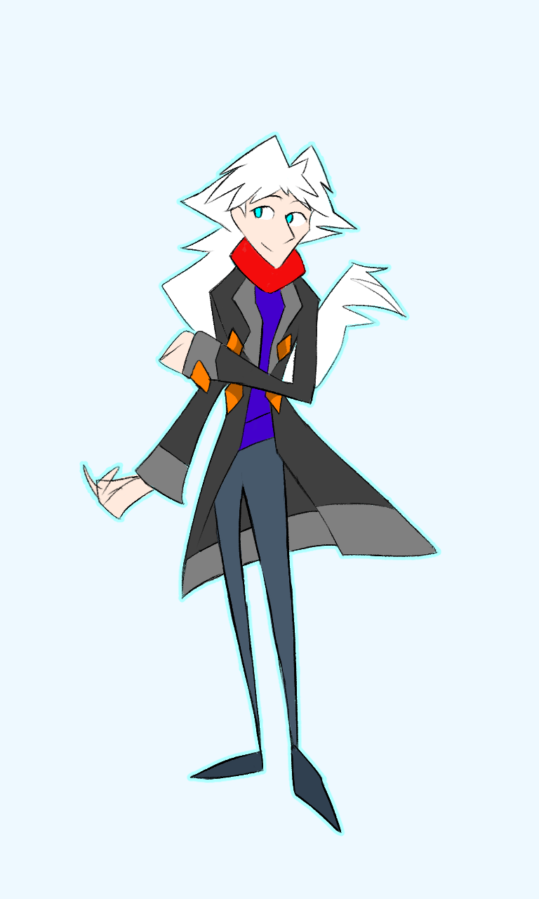

---
humorous:
  - ermine vicar(r)
tags:
  - undyed
  - vicerre
  - winter coat
---

# Illustration 075 – Winter Coat (2024-12-14)

## Overview

Recently, I had an interesting discussion with @Chillie about my characters. When associating an animal with Vic, Chillie landed on that of a stoat. Stoats are weasel-like in nature and have brown-and-white fur, both traits associated with Vic.

I then realized that ermines were another name for stoats, and Armin was another name for Vic. Given how ermines grew summer and winter coats, the rest of the drawing came together.

## Design notes

- This is not the first time I have drawn Vic wearing a black coat. I have drawn him with a black coat on prior occasions—though never in this particular style ([1](../2022-h2/2022-11-12_illustration-012_outfits.md), [2](../2024-q4/2024-12-14_illustration-075_winter-coat.md)).
