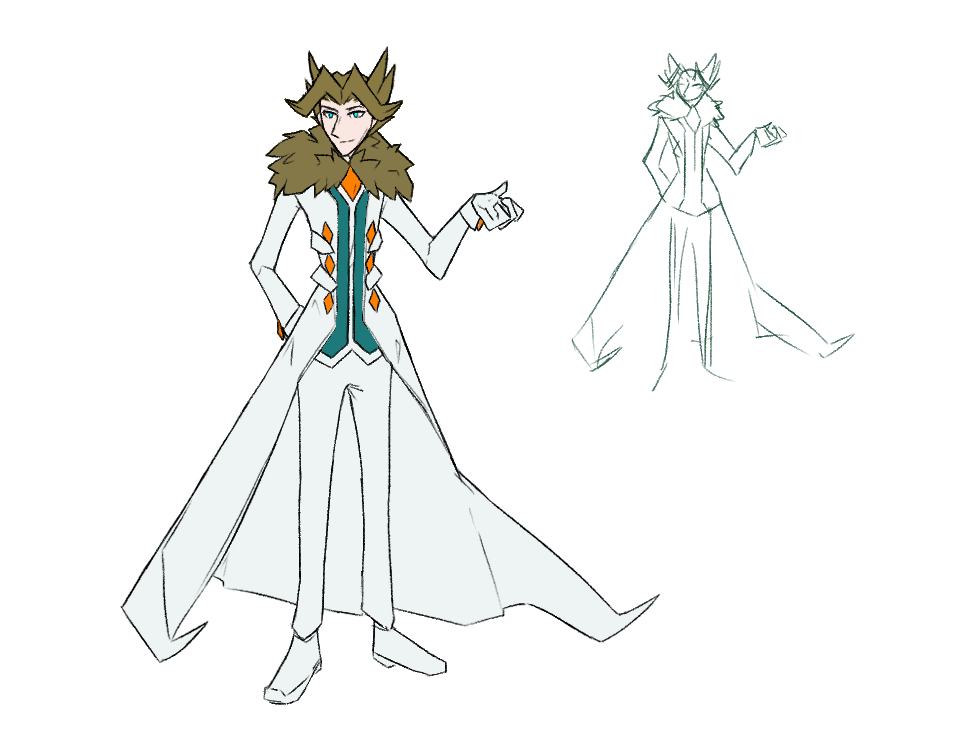

---
tags:
  - alis
---

# Rendition 079 – Alis with Realistic Proportions (2025-01-18)

## Overview

I was inspired by the art of @Yokaiju to draw my characters in a more realistic style. As the character with the least amount of reference art, I chose Alis as the subject of this style study.

## Design notes

The goal of this drawing was to draw more reference art of Alis. However, given the stylistic departures of this image, I cannot use it as such.
