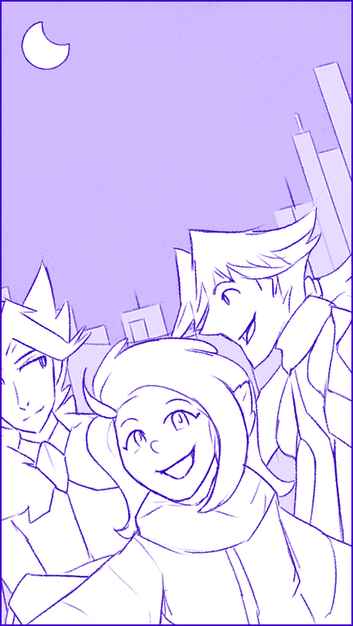

---
humorous:
  - That's no moon!
  - Although technically...
tags:
  - alis
  - eclipse
  - selfie
  - solana
  - vicerre
---

# Illustration 086 – Selfie 4 (2025-01-19)

## Overview

Team Arklight goes to watch a solar eclipse.

This image is the fourth in my series of character selfies.

## Design notes

- Originally, I wanted to draw a selfie showing the development of Solana's and Vic's relationship. However, I did not want to include Alis as a [third wheel](https://en.wiktionary.org/wiki/third_wheel), so I opted for an alternate composition.
- In contrast to my previous selfie illustrations, I opted for a vertical composition over a horizontal composition.
- In contrast to my previous selfie illustrations, Alis is depicted smiling.

## Resources used

- [1](assets/2025-01-19_image-261.png)

## Workflow (DALL·E 3)

> selfie of three people with a solar eclipse behind them, low-angle shot, wide shot, vertical aspect ratio, perspective, anime style

## Bonus material

- [Clip Studio Paint bug – incorrect compositing](assets/2025-01-19_image-263.png)
