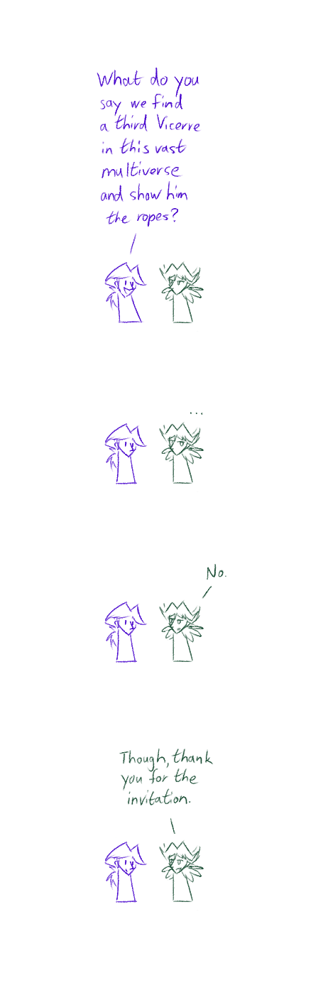

---
humorous:
  - disappointing
tags:
  - alis
  - "location: Vicerre's lab"
  - "pov: vicerre"
  - vicerre
---

# Vignette 084 – The Life Cycle of a Vicerre

> 1. [x] Become scarred and abandon your trust in humanity
> 2. [x] Decide to never be hurt again (through force)
> 3. [x] Meet resistance and rediscover the spark that pushes you forward
> 4. [x] Become afraid of forging new bonds and decide to raze that spark
> 5. [x] Realize that others sincerely care about you (and you care about them)
> 6. [ ] Become consumed with guilt and liberate your existing memories
> 7. [ ] Live a half-life bereft of past pain
> 8. [ ] Integrate memories old and new into a new gestalt
> 9. [x] Find your footing in life
> 10. [ ] Pay your experiences forward

---

