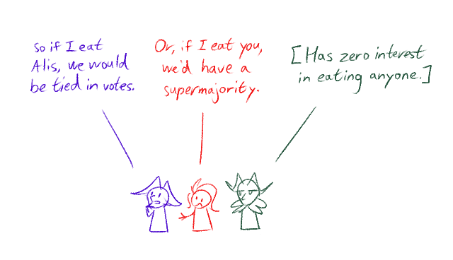

---
tags:
  - favorite character poll
---

# Meta 036 – Favorite Character Poll

I was curious about how popular each of my characters was.

To evaluate how popular my characters were, I held a quick, informal poll on a Discord server ([2025-01-27 – 2025-01-28](https://discord.com/channels/448538687983321098/1020875112045613217/1333456530430754879)).

Here are the results of this poll:

- Alis (1): Kiwi
- Solana (4): breadstickslug, IMakeNoSense, Moppnttef, poco
- Vic (3): Chillie, EnderTrenton, YuIOTJ

<!--
No vote: amemcake, Darquezze306, Sunfished, Yokaiju

Late vote:
- Alis (Gravity Monkey)
- Solana (Falgaia)
- Vic (Gravity Monkey)
-->

Coming into this poll, I had a few impressions on the popularity of each character:

- I knew that Solana was the most popular character to draw. However, I wasn't sure how that translated to outside of art.
- I knew Vic received the most attention from narrative-driven posts. However, I wasn't sure how that translated outside of writing.

I found the results quite interesting:

- I expected Solana to be more popular. However, Vic put up a strong showing in the polls as well.
- I learned more about the interests and preferences of people on the server.

## Bonus sketch

