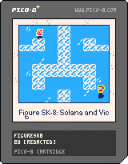

---
humorous:
  - lua/43b8x2h22
tags:
  - figuresk8
  - figure skate
  - hello world
  - pico-8
---

# Meta 040 – PICO-8 (2025-03-01 – 2025-03-12)

## Overview

I made a game demo in PICO-8 starring Vic and Solana.

## Design notes

- As a so-called "fantasy console", the development environment is custom-tailored for developing games. Building on PICO-8 feels natural compared to building on an engine that uses a general programming language.
- PICO-8's API accommodates the sensibilities of modern programming languages. For example, there is no mismatch between the orientation of the system's Cartesian coordinates and its trigonometric functions.
- The restrictive nature of the console is fantastic for development. I can focus on gameplay much more when I don't need to plan out graphic or sound design.
- PICO-8's minimalist API acts as an excellent learning tool. Unlike a game engine that defines how I should structure my code, I'm learning a lot from working through how I should think of my own data models and update loop.
- Coming from JavaScript, I found Lua to be a fine language to work with. I never felt like I was fighting the language when coding in it. That said:
  - The lack of proper linting and dynamic type system makes language more precarious to use with larger code bases.
  - The 1-indexed and inclusive-ended nature of Lua makes it tricky to use with 0-indexed algorithms (e.g. merge sort). What exacerbates this problem is that certain features in PICO-8 are 0-indexed (e.g. sprite rendering).
- The graphics tools bundled with the console aren't really designed for existing artists. I found myself missing the keyboard shortcuts commonly used by programs like Adobe Photoshop and Clip Studio Paint.
- The lack of debugging tools becomes painfully evident the more complex the game gets. The lack of a built-in debugger or testing framework means I would spend much more time tracing through code than I would have liked working with a more mature framework.

## Miscellaneous notes

- The name of this game, "Figuresk8", is a quadruple pun:
  - **Figure skating** is the activity my characters partake in.
  - The name "Figuresk8" mimics the naming convention of the PICO-8 as an **8-bit** fantasy console.
  - **Figure eights** are a well-known pattern in ice skating.
  - The framing device for this game resembles the **numbered figures** seen in research papers.
- When coding this game, I had to implement from scratch all of the features people might take for granted in a fully-fledged game engine. This includes the following features (in order of implementation):
  - player state
  - keyboard control
  - 2D physics
  - sprite from player state
  - debugging tools
  - particle physics
  - cursor control
  - collision detection (hard)
  - UI elements
  - object-oriented programming (actor model)
  - z-indices
  - testing framework
  - multiplayer (hard)
  - dynamic camera
  - time trial

## Inspirations

- _Hades II_

## Resources used

- [Awesome PICO-8](https://github.com/pico-8/awesome-PICO-8)
- [Cartdata | PICO-8 Wiki | Fandom](https://pico-8.fandom.com/wiki/Cartdata)
- [Celeste](https://www.lexaloffle.com/bbs/?tid=2145)
- [Computer Modern Serif Modern](https://www.1001fonts.com/cmu-font.html)
- [Depict](https://bikibird.itch.io/depict) – Converts images into PICO-8 palette.
- [Free PICO-8](https://github.com/drerx/PICO-8_free)
- [Hilbert curves, first and second orders](https://en.wikipedia.org/wiki/Hilbert_curve#/media/File:Hilbert_curve_2.svg)
- [Lua – OneCompiler](https://onecompiler.com/lua/)
- [Nerdy Guide | EXPORT_CART](https://nerdyteachers.com/PICO-8/Guide/EXPORT_CART)
- [PICO-8 Education Edition for Web](https://www.lexaloffle.com/bbs/?tid=47278)
- [Save | PICO-8 Wiki | Fandom](https://pico-8.fandom.com/wiki/Save)
- [Shrinko8](https://www.lexaloffle.com/bbs/?tid=48591): PICO-8 minifier and linter.

<!--

- `reboot`: create new project
- `load <project>`: loads `<project>.p8`
- `run`: runs loaded project
- `.` steps through project frame-by-frame
- `save <name>`: exports the current project as a `.p8` file
-->
