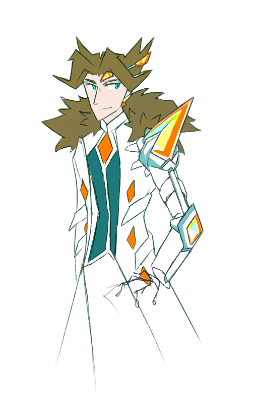

---
tags:
  - alis
  - concept art
  - prop design
---

# Illustration 093 – Wearable Arm Console (2025-03-22)

## Overview

A drawing of Alis wearing some technology he designed.

The designs in this image are not finalized and should instead be interpreted as concept art.

## Design notes

- As of writing, I do not have a grasp on how to draw fictional technology. For this reason, I cannot be confident in what design I give Alis's technology.
- In real life, any sort of arm-mounted technology would strive to be as disruption-free and seamless as possible. However, this is not visually distinct. For this design, I instead made the following concessions:
  - I made the technology more visually bulky, as this breaks up Alis's silhouette.
  - I added an otherwise-new color to this design element, as this makes it visually prominent.
- I chose yellow as an accent color for the following reasons:
  - Given his existing of orange, ochre, green, and blue, yellow complements Alis's analogous color scheme.
  - When placed among other characters in a [Chromatic Arrangement](https://tvtropes.org/pmwiki/pmwiki.php/Main/ChromaticArrangement), yellow further emphasizes Alis's theme color within that arrangement.

## Resources used

- Colress from _Pokémon Sun and Moon_
- The DC Mini from _Paprika_
- Google Chrome from _I Made A Comic About Internet Explorer_
- Seto Kaiba from _Yu-Gi-Oh! The Dark Side of Dimensions_

## WIPs

- [1](https://media.discordapp.net/attachments/1208868988851847168/1353207358423306394/image.png)

## Bonus sketch

