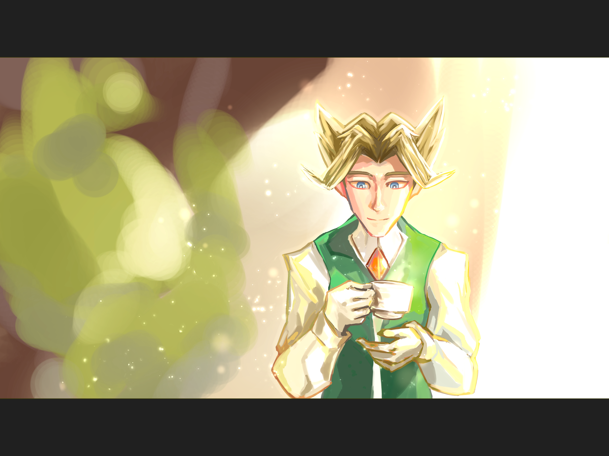

---
humorous:
  - shine on you depressed diamond
tags:
  - alis
  - tea
---

# Rendition 081 – Goldenrod (2025-05-25, 2025-05-31, 2025-06-12, 2025-06-16, 2025-06-19 – 2025-06-20)

## Overview

Alis is associated with goldenrod lighting, so I've always wanted to draw him in this sort of lighting. Given my experiences with seasonal affective disorder, I felt like drawing something that represented my improvement in mood. Therefore, I drew a depiction of Alis at a happier time.

## Design notes

- Between other hobbies, the release of _Deltarune_, the Unseen Update of _Hades II_, and real life, I found it difficult to get into a groove for completing the piece. In the end, I found the piece just disjointed enough for me to be dissatisfied with it.
- The lighting in this piece deliberately mimics overexposure in photography.
- I struggled to mesh the stylistic elements of my character designs with the more realistic qualities of a painterly art style. In the future, I might try to draw the image in a more stylistic art style from the onset.

## Resources used

- [Young Asian smiling businesswoman in suit drinking coffee isolated on white background.](https://stock.adobe.com/images/-/373420685)
- [Young Man Drinking Tea Stock Photo](https://www.shutterstock.com/image-photo/172397729)
- ["冷吗？"](https://www.pinterest.com/pin/1055249756414501297/)
