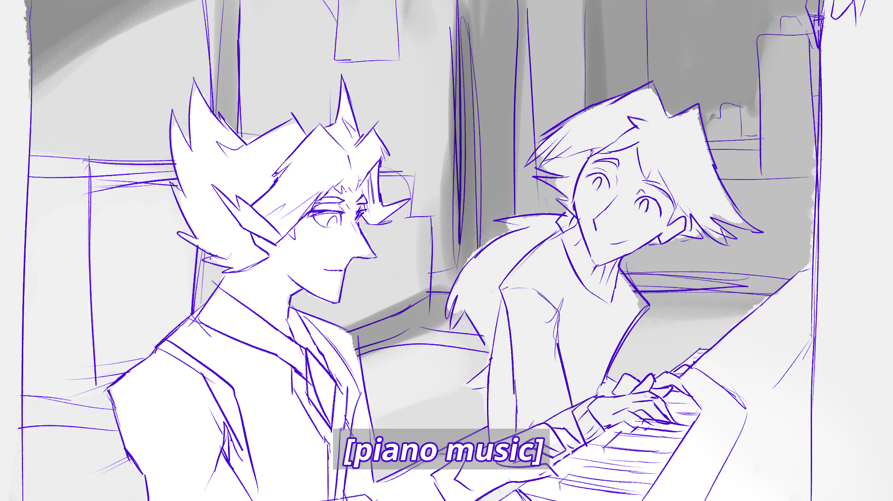

---
tags:
  - alis
  - math rock
  - vicerre
---

# Illustration 096 – Duet (2025-06-30 – 2025-07-01)

## Overview

[The last time we saw Alis and Vic at the piano, the former had just started to take lessons from the latter.](https://github.com/vicerre/spaghetti-ice/blob/main/posts/2024-q1/2024-02-12_vignette-070_piano.md) Since then, Alis has improved to the point where he and Vic can perform a duet. The image associated with this post depicts this activity.

## Design notes

- This image reflects Alis's character development. Originally, he was hyper-independent, but as he has spent time with Vic and Solana, this trait has diminished. This progress is depicted here as him and Vic playing a piece that requires both of them to be in tandem.
- In this piece, Alis takes the role of the melody, and Vic takes the role of the harmony. This decision matches their respective roles as characters; Alis acts as the trailblazer, and Vic acts to support others on their journey.

## Story notes

- Alis is a technical-minded person. When approaching a task such as playing the piano, he grasps the technical foundations quite readily. However, it takes more coaxing for him to grasp the concept of music as a form of expression, which Vic takes strides to entail here.

## Resources used

- [Female Pupil With Teacher Playing Piano In Music Lesson](https://stock.adobe.com/images/female-pupil-with-teacher-playing-piano-in-music-lesson/183480235)

## Bonus material

- [Textless alt](assets/2025-07-01_image-319.png)

## WIPs

- [1](https://cdn.discordapp.com/attachments/1208868988851847168/1389433291308011583/harmonicfrequencies.png)
- [2](https://cdn.discordapp.com/attachments/1020875112045613217/1389767995433287763/hornandivorykeys.png)
