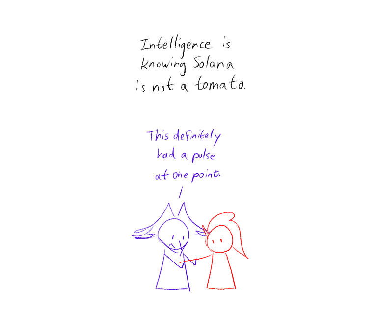
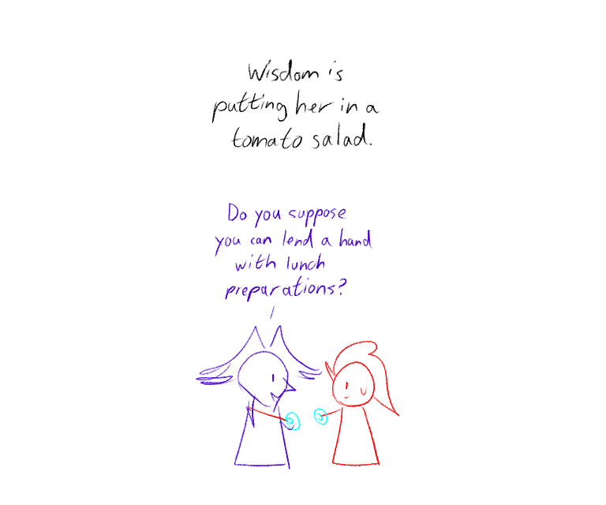
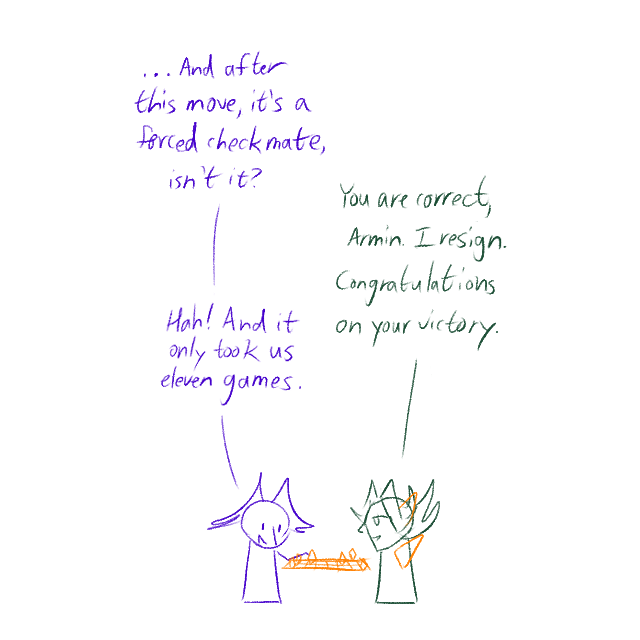
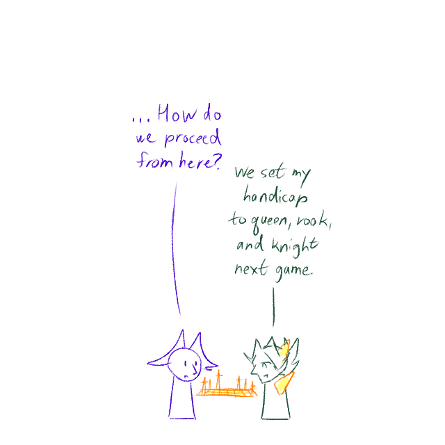
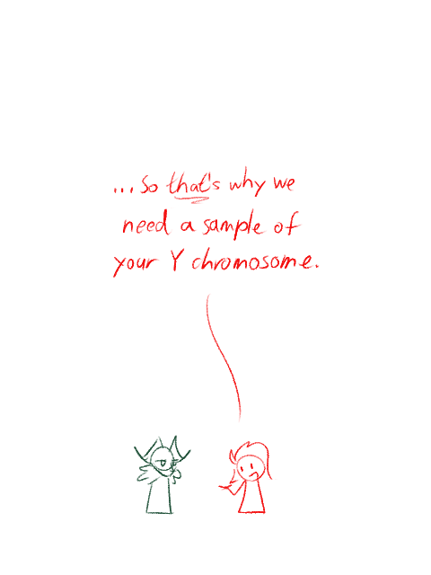
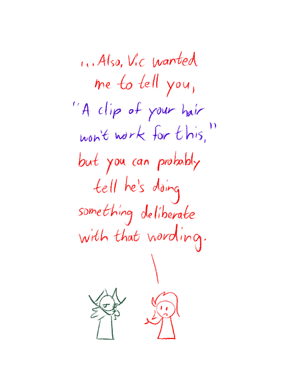
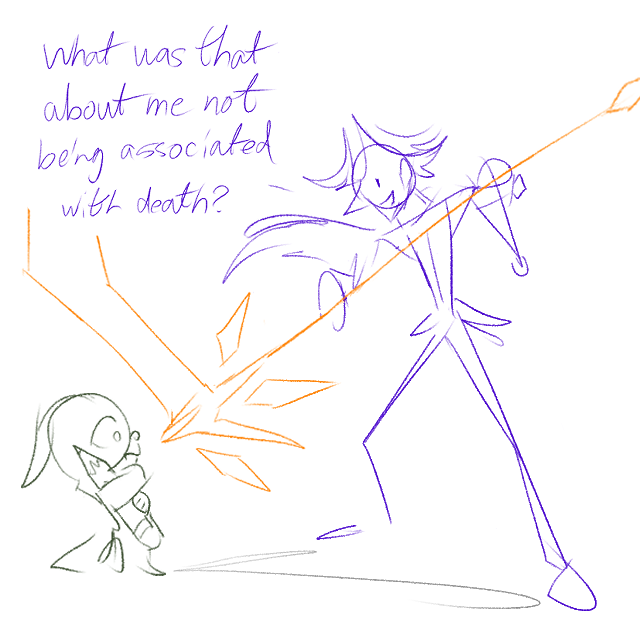

---
humorous:
  - self-experimentation
  - when you misplace the y chromosome
tags:
  - alis
  - checkmate
  - genetics
  - intelligence
  - pupscout
  - scythe
  - solana
  - vicerre
  - wisdom
  - y-chromosome
---

# Doodle 048 – Tomato Salad (2025-06-26)

# Doodle 049 – Light Chess (2025-07-03)

# Doodle 050 – Y Chromosome (2025-07-06)

# Doodle 051 – Death by Association (2025-07-07)

[non-canon]

## Overview

n/a

## Resources used

- [Handicap (chess)](<https://en.wikipedia.org/wiki/Handicap_(chess)>)
