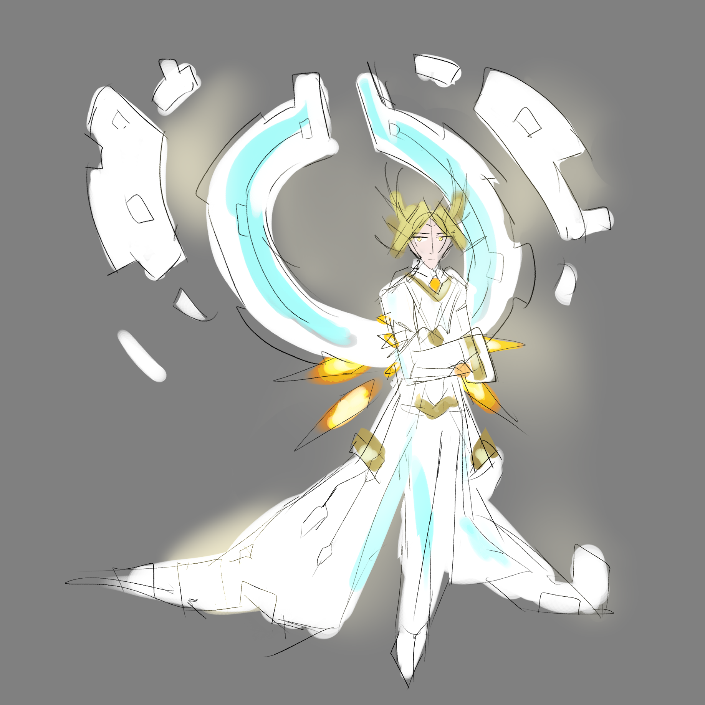

---
humorous:
  - ivory ice
tags:
  - alis
  - sketch
---

# Illustration 098 – Technotheism (2025-07-11 – 2025-07-12)

[non-canon]

## Overview

Recently, Alis has accumulated a number of inspirations and themes, enough that I felt inspired to draw them out. This image is a sketch in which I depict these inspirations as an "ultimate form" style of design.

## Design notes

Theme inspirations:

- _deus ex machina_
- edelweiss
- goldenrod
- horn and ivory
- ivory tower
- white rook

Design inspirations:

- [Ao Guang](https://ne-zha.fandom.com/wiki/Ao_Guang) (_Ne Zha 2_)
- [Chronos](https://hades.fandom.com/wiki/Chronos?file=Portraits_Chronos_01.png) (_Hades II_)
- [Colress](https://bulbapedia.bulbagarden.net/wiki/Colress#/media/File:Colress_SM_concept_art.png) (_Pokémon Sun and Moon_)
- [Kanako Yasaka](https://en.touhouwiki.net/wiki/Kanako_Yasaka) (_Touhou Fūjinroku ~ Mountain of Faith_)
- [Teiris](https://wolfgangarchive.com/sites/Dragon-Force-New-Site/teiris.html) (_Dragon Force_)
- [Viktor (Machine Herald)](https://arcane.fandom.com/wiki/Viktor?file=Glorious+Evolution.jpg) (_Arcane_)

Additional notes:

- Alis's eyes are gold in this design, as he has fully embraced Oneiros in this timeline.

## WIPs

- [1](https://cdn.discordapp.com/attachments/1208868988851847168/1393440976567013456/akaifaliswereasunoc.png)
