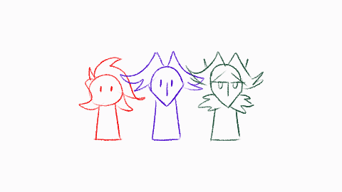

---
humorous:
  - after four years
  - i can finally draw them
tags:
  - alis
  - character turnaround
  - solana
  - vicerre
---

# Rendition 083 – Alis Settei (2025-07-19 – 2025-07-20)

# Rendition 084 – Vic Settei (2025-07-20 – 2025-07-25)

# Rendition 085 – Solana Settei (2025-07-27 – 2025-08-01)

## Overview

Character turnarounds of my main cast, drawn in the style of _settei_.

## Design notes

This is the first time I've drawn Solana, Vic, and Alis together in this art style. In doing so, I learned a lot about drawing characters consistently:

- This project required me to take measurements to ensure references matched each other. Whereas I winged how tall characters were in previous illustrations, I could not do that here.
- In drawing my characters from multiple angles, I had to draw them in 3D space. For Vic and Alis, in particular, this came as a challenge, as I originally designed them from a time when I did not have the proper spatial awareness. However, as a result of this exercise, I now know how to represent my characters as 3D volumes.
- In the process of defining my characters in 3D space, I unlocked a thought paradigm in which I could reason about human figures as 3D primitives in perspective. It is this realization that finally tipped the scales toward the science of drafting over the art of drawing.
- Previously, I designed Solana to be around a half-head shorter than Vic. In practice, however, this difference comes out to be closer to a full head.
- Previously, I designed Vic and Alis to share the same height but look dissimilar visually. As of this image, I've determined that the visual difference comes from posture _à la_ Clark Kent and Superman.
- Like in my previous manga-inspired project, I incorporated L-shaped brackets into the design of this composition.

In localizing and transcribing character information into Japanese, I learned how the Japanese language operates. This includes the following elements:

- When names use surname/given name order (or vice versa).
- Which characters are commonly found in traditional Japanese names.
- The difference between a "マフラー" (muffler) and a "スカーフ" (scarf).

Solana's localized name incorporates a complex multilingual pun:

- "Solana Sié" uses "solana", meaning "sunspot".
- "Solana Sié" uses "solanaceae", meaning a family of flowering plants.
<!--- "日向" is a common Japanese surname, meaning "sunspot".-->
- "空菜" uses "空", a popular name element, meaning "sky".
- "空菜" uses "菜", a common character in women's names, meaning "vegetable".
- "空菜" is pronounced "Sorana".
- "詩絵" uses "詩", meaning "poetry".
- "詩絵" uses "絵", meaning "painting" or "drawing" or "illustration".
- "詩絵" is a common Japanese woman's name.
- "詩絵" is pronounced "Shi-e".

## Explanation

Transcriptions:

- Version: 仮設定
- Height comparison: 身長比較

Alis:

- Alis's name: アリステア・ヴィチェレ
- Alis's brooch: 首元のひし形のパーツは／ネクタイではなく、／ブローチです。
- Alis's longcoat: ロングコートは／常に広がっているように／演出してください。

Vic:

- Vic's name: アルミン・ヴィチェレ
- Vic's eyes: 目の色は #00FFFF。／普通の水色ではなく、 ／この色を／使用してください。
- Vic's coxcomb: 正面・背面からは／トサカ（前髪）は／見えないように／描いてください。／横から見える角度のみ、／描写 OK です。
- Vic's scarf: マフラーの描写は／厳密である必要は／ありません。／自由に描いて構いません。
- Vic's linework: ラインの流れにある／くぼみを意識して、／ふくらませないように。

Solana:

- Solana's name: 日向空菜
- Solana's portals: ポータル間にある／彼女の腕の線を／消去してください。
- Solana's elbows: ポータルが／肘に／かからないように／配置してください。
- Solana's tail ring: このポータルは／多くの角度からは／見えません。
- Solana's tail: しっぽは／短く丸まった形に／縮めることもできます。

## Resources used

- [[Auelana] PP Commission #5](https://www.deviantart.com/cancerthegiantcrab/art/997996369)
- [Character Design Crash Course#Character Turnaround](https://docs.google.com/document/d/1IgswlDEFUe2owv2XZbeFUJt8_pYLsAxfM2HX3T0-g8Q/edit?tab=t.0#heading=h.vj611my02um9)
- [ChatGPT](https://chatgpt.com/)
- [human hand holding something, isolated on white background.](https://www.alamy.com/133938144.html)
- [JustSketchMe](https://app.justsketch.me/)
- [Miles Edgeworth character sheets from the Ace Attorney anime](https://www.reddit.com/comments/tfr2kd/)
- [N_Regular_00](https://sketchfab.com/3d-models/1e82080420e24639a3aaf0fcd6f85719)
- [Settei: Enen no Shouboutai](https://setteidreams.net/settei/enen-no-shouboutai/index.php?pic=038.png)
- [Settei: Yu-Gi-Oh!: The Dark Side of Dimensions](https://setteidreams.net/settei/yu-gi-oh-the-dark-side-of-dimensions/)
- [Wind Agency members' character profile](https://jgfiles.tumblr.com/post/166925788947/)

## WIPs

Alis:

- [1](https://cdn.discordapp.com/attachments/1199266049917464616/1396327603379503144/fearfulsymmetry.png)
- [2](https://cdn.discordapp.com/attachments/1199266049917464616/1396583301921374279/microwavedalis.png)

Vic:

- [1](https://cdn.discordapp.com/attachments/1199266049917464616/1396611838028025998/twinsiesquestionmark.png)
- [2](https://cdn.discordapp.com/attachments/1199266049917464616/1396670758083756212/standinghere.png)
- [3](https://cdn.discordapp.com/attachments/1199266049917464616/1396997498308001863/irealize.png)
- [4](https://cdn.discordapp.com/attachments/1199266049917464616/1397556117084831845/youwerejustlikeme.png)
- [5](https://cdn.discordapp.com/attachments/1199266049917464616/1398142855750619146/tryingtomakehistory.png)
- [6](https://cdn.discordapp.com/attachments/1199266049917464616/1398466959812595722/butwhostojudge.png)

Aside:

- [1](https://cdn.discordapp.com/attachments/1199266049917464616/1398499893592457346/therightfromwrong.gif)

Solana:

- [1](https://cdn.discordapp.com/attachments/1199266049917464616/1399108430429425745/whenourguardisdown.png)
- [2](https://cdn.discordapp.com/attachments/1199266049917464616/1399177998690685159/ithinkwellbothagree.png)
- [3](https://cdn.discordapp.com/attachments/1199266049917464616/1399731048430043247/thatviolencebreedsviolence.png)
- [4](https://cdn.discordapp.com/attachments/1199266049917464616/1400316167469531146/butintheend.png)
- [5](https://cdn.discordapp.com/attachments/1199266049917464616/1400638013687730176/ithastobethisway.png)
- [6](https://cdn.discordapp.com/attachments/1199266049917464616/1400661910772256881/orchestrosolo.png)

All:

- [1](https://cdn.discordapp.com/attachments/1199266049917464616/1400871485295431871/policelineup.png)
- [2](https://cdn.discordapp.com/attachments/1199266049917464616/1400940042716971058/image.png)
- [3](https://cdn.discordapp.com/attachments/1199266049917464616/1400940043916284016/image.png)
- [4](https://cdn.discordapp.com/attachments/1199266049917464616/1400940045204062479/image.png)

## Bonus sketches

