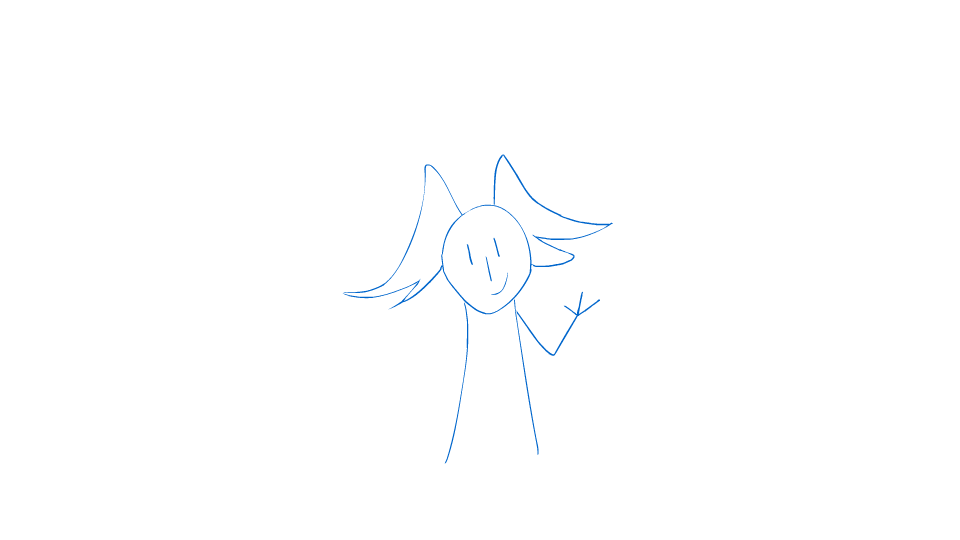
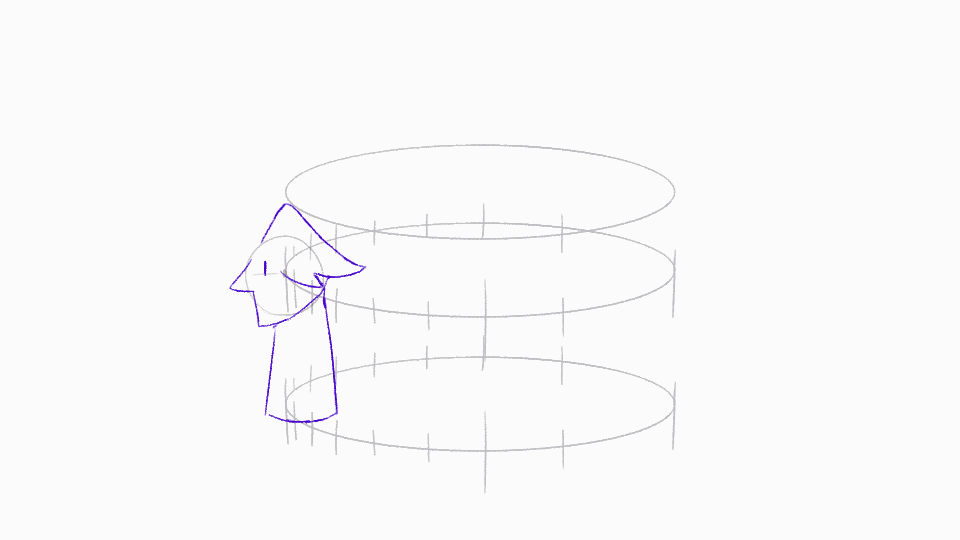
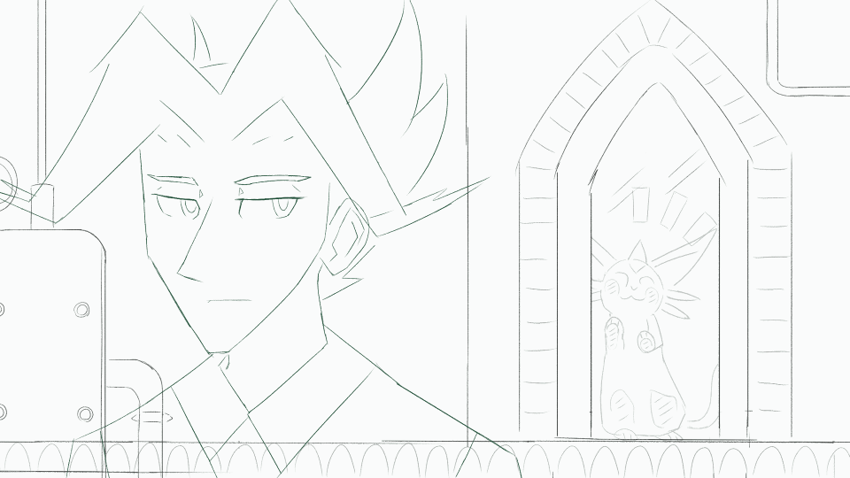

---
humorous:
  - overextended
  - Wait, it's all physics?
  - Always has been.
tags:
  - alis
  - neko
  - spin
  - vicerre
  - wave
---

# Rendition 086 – Animated Wave (2025-08-10)

# Rendition 087 – Animated Orbit (2025-08-14 – 2025-08-15)

# Rendition 088 – Blink + Head Turn (2025-08-16 – 2025-08-18)

## Overview

- A ["Hello, world!"](https://en.wikipedia.org/wiki/%22Hello,_World!%22_program) animation of Vic rendered in Adobe Animate.
- A character head turn cycle rendered in Clip Studio Paint EX.

## Design notes

- These exercises don't represent my first dance with animation. However, these exercises _do_ represent the first time I approached the subject with a degree of scientific rigor.
- With this exercise, I finally found a reason for drawing the sphere as the starting point for drawing the head. In laying out the locations of the spheres, I was able to use them as reference points in perspective for where other body parts should lie.
- Even with significant simplification, my characters' hairstyles are painful to adapt into an animated format:
  - In animating Vic's hair, I had to employ a [Cheated Angle](https://tvtropes.org/pmwiki/pmwiki.php/Main/CheatedAngle) as it transitioned from a side-facing angle to a back-facing angle.
  - In animating Alis's hair, I animated it at half the frame rate as the rest of his design.
- The more I learn about animation, the more I learn the following: animation is as much about keeping things still as it is about making things move. It is the interplay of "stop" vs. "go" that gives animation its, well, animated effect.

## Resources used

- [51 Great Animation Exercises to Master](https://www.animatorisland.com/51-great-animation-exercises-to-master/)
- [The interior ceiling of the Santa Maria del Fiore ¨Duomo stock photo](https://www.istockphoto.com/photo/1480629498-508237060)
- [Head turn 01](https://www.animatorisland.com/animation-secret-getting-there-is-half-the-fun/headturn01/)
- [[Live] Animating a head turn with eye blink](https://www.animatorisland.com/live-animating-a-head-turn-with-eye-blink/)
- [Opera di Santa Maria del Fiore – Virtual tours](https://duomo.firenze.it/en/634/virtual-tours)
- [Two Ways to Animate a Blink](https://www.youtube.com/watch?v=lgqQFz9sA48)
