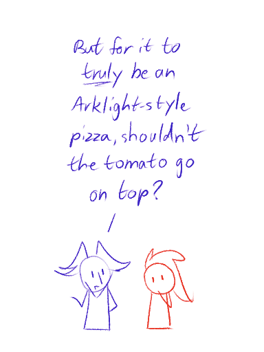
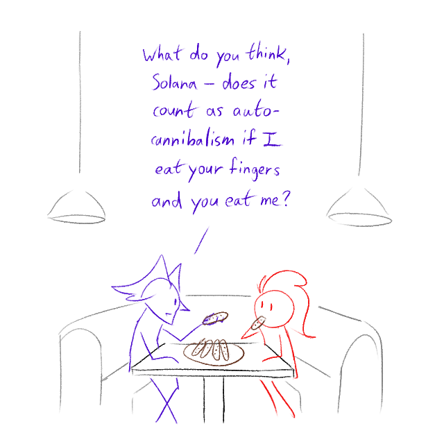
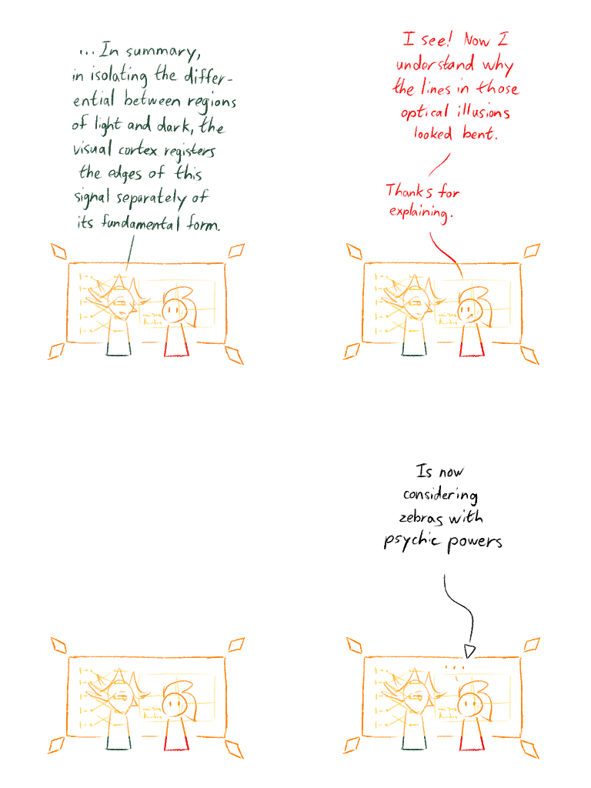
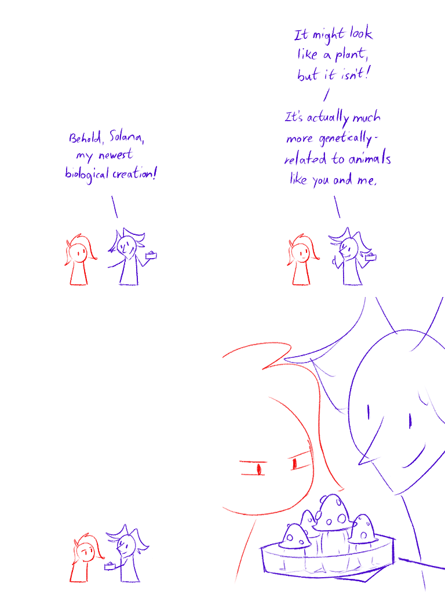
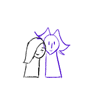
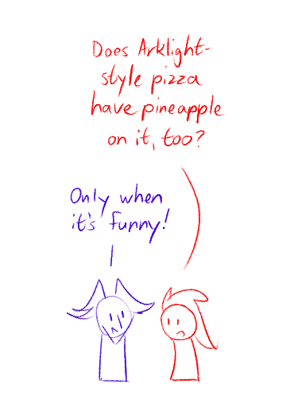

---
humorous:
  - cafe wall
  - fungus among us
  - it's eat and be eaten
  - pizza margherita
tags:
  - alis
  - amanita muscaria
  - fly agaric
  - mushroom
  - petri dish
  - solana
  - storyteller
  - vic
  - zebra
---

# Doodle 061 – Pizza Toppings (2025-08-28)

# Doodle 062 – Ladyfingers (2025-09-01)

# Doodle 063 – The Workings of Optical Illusions (2025-09-07)

# Doodle 064 – Among Us (2025-09-12)

# Doodle 065 – Unpuzzled (2025-09-14)

## Overview

n/a

## Resources used

Doodle 062:

- [Cute booths – Picture of Sugar Bowl Ice Cream Parlor, Scottsdale](https://www.tripadvisor.com/LocationPhotoDirectLink-g31350-d334388-i175391950.html)
- [Dodo booths – Picture of Galliano's Ice Cream Parlour, Carlisle](https://www.tripadvisor.com/LocationPhotoDirectLink-g190736-d6676199-i106307221.html)

Doodle 063:

- [Intro to Neuroscience](https://www.youtube.com/watch?v=nlSL7Qg7-Po&t=1907s)
- [Lines you'd never guess are straight](https://www.reddit.com/comments/1n9nkog/)
- [The truth behind why zebras have stripes](https://www.bbc.com/future/article/20191031)

Doodle 064:

- [Loading Artist](https://loadingartist.com/)

<!--

Solana: Hey Alis! Check out this cool optical illusion I found.

Solana: It's really weird how the lines in this picture look bent.

Solana: Can you tell me more about how it works?

Alis: Certainly, Solana.

---

Alis: ...In other words, in isolating the differential between regions of light and dark, the visual cortex registers the edges of this signal separately of its fundamental form.

Solana: I see! Now I understand why the lines in those optical illusions looked bent. Thanks for explaining.

Caption: Is now considering zebras with psychic powers

-->

## Bonus sketch

