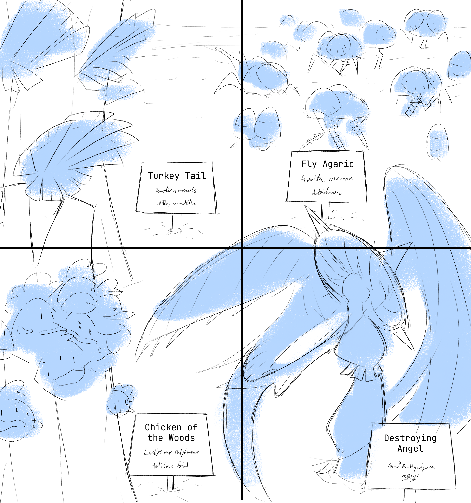

---
tags:
  - chicken of the woods
  - destroying angel
  - fly agaric
  - turkey tail
---

# Illustration 099 – Mycology (2025-09-14)

## Overview

Vic designs a mushroom farm.

<!--

- Panel 1 caption: Turkey Tail (_Trametes versicolor_) _edible, non-nutritive_ /
- Panel 2 caption: Fly Agaric (_Amanita muscaria_) _detritivore_ /
- Panel 3 caption: Chicken of the Woods (_Laetiporus sulphureus_) _delicious fried_ /
- Panel 4 caption: Destroying Angel (_Amanita bisporigera_) _RUN!_
-->

## Design notes

- The scientific name of the destroying angel species used in this comic (_Amanita bisporigera_ vs. _Amanita ocreata_ vs. _Amanita virosa_) was determined by the location of Vic's lab (outside New Quendon).

## Resources used

- [7 Falls Mushroom Farm](https://www.localharvest.org/7-falls-mushroom-farm-M60959)
- [Arboretum Tags/ Tree Tags/ Plant Signs](https://www.nationalband.com/arboretum-tags-layout-2-lines-of-text-3-options/)
- [Housefly](https://en.wikipedia.org/wiki/Housefly)
- [1](https://www.pinterest.com/pin/163537030214556161/)
