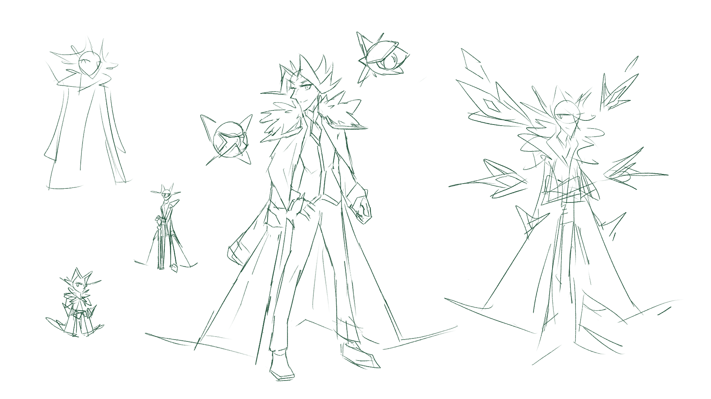
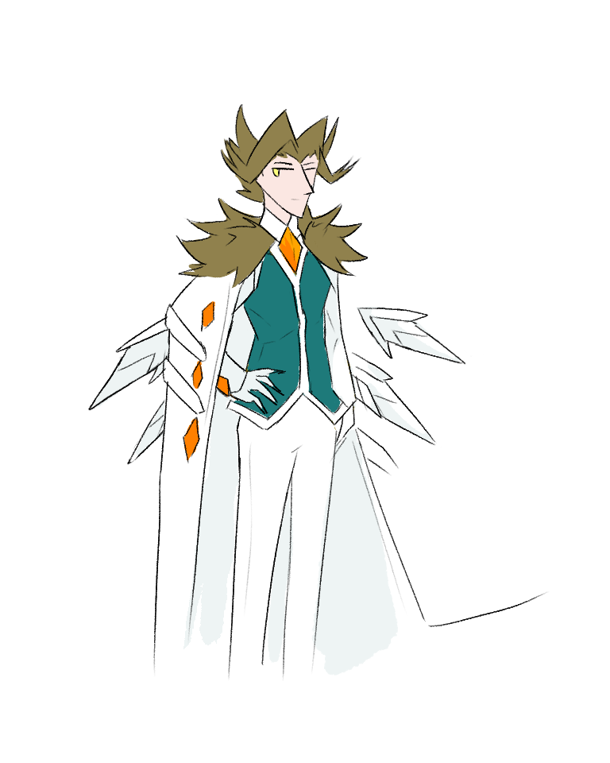
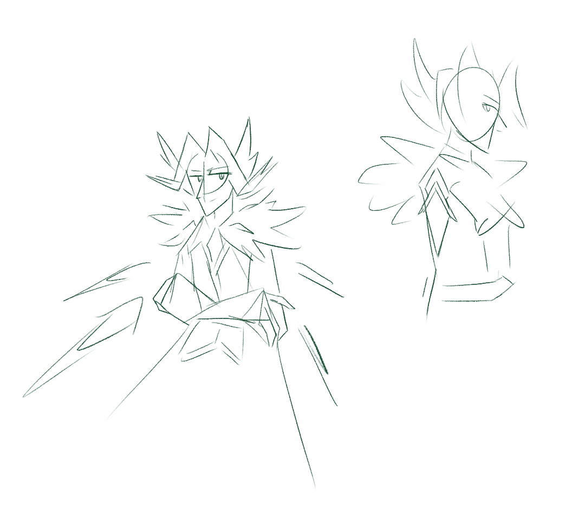

---
tags:
  - alis
  - mantle
  - sketch
  - wings
---

# Illustration 100 – Holofoils (2025-11-09, 2025-11-30 – 2025-12-01)

## Overview

Concept art for Alis with technology integrated into his outfit in the form of small, magnetically-controlled foils.

## Design notes

- Given his recent technological work, I wanted to incorporate a tech-inspired element into Alis's visual design.
- The very principle of including sci-fi inspired elements ran against my design principle of wanting my characters to look plausible in real life. I wanted to ensure any technological elements looked practical to have at, say, a board game evening. In the end, I came up with a set of minimalistic foils that could project larger, holographic elements to give Alis a more imposing presence if needed.
- One of Alis's motifs is the gradual metamorphosis of winter into spring. As a nod to this motif, the holofoils in his design are loosely designed after the petals of a flower bud. Ultimately, the visual language of the holofoils ended up being reminiscent of [the memory pods used in the _Kingdom Hearts_ franchise](https://www.khwiki.com/Pod).
- Initially, I wanted Alis to wear his longcoat like a mantle instead. However, I didn't want to figure out how the clothing folds translated, so I dropped that visual element. You can see, however, what I tried in concept art.

## Resources used

- [Is there a set of words for the transitions between the seasons?](https://redd.it/6opd2v/)
- [Limb Enhancers | Steven Universe Wiki](https://steven-universe.fandom.com/wiki/Limb_Enhancers)
- [Sword Dance | Megami Tensei Wiki](https://megamitensei.fandom.com/wiki/Sword_Dance)
- [Zhongli | Genshin Impact Wiki](https://genshin-impact.fandom.com/wiki/Zhongli)
