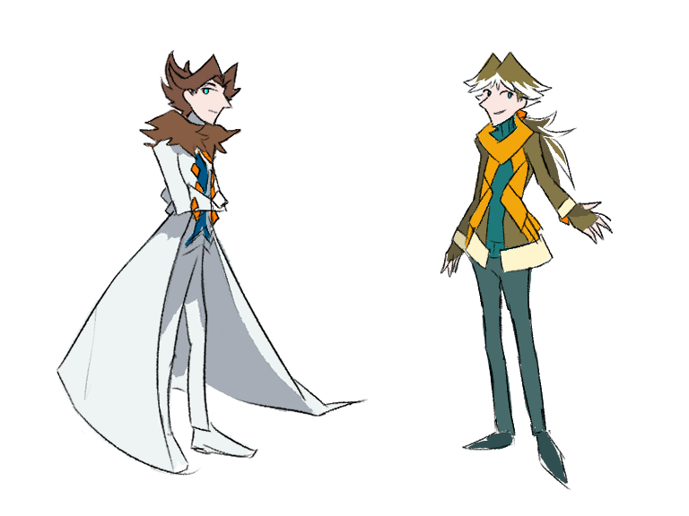
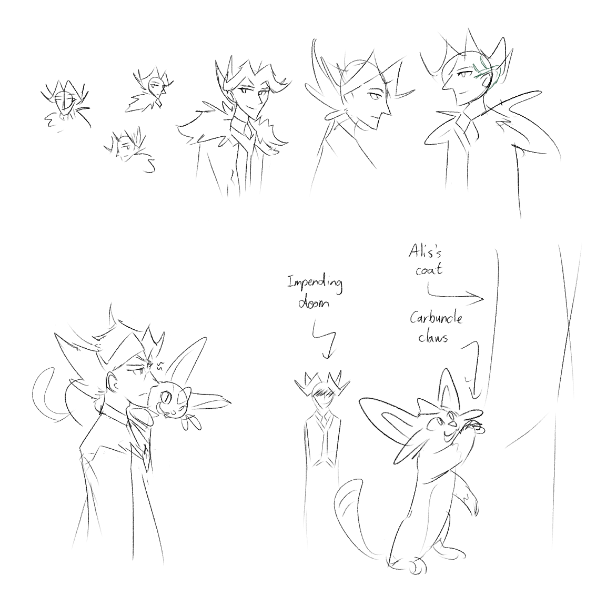
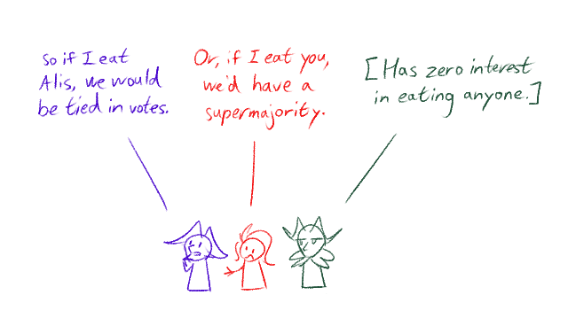

---
tags:
  - alis
  - neko
  - solana
  - vicerre
---

# Illustration 106 – Palette Swap (2025-01-25)

# Illustration 107 – Alis and Neko (2025-01-25 – 2025-01-28)

# Illustration 108 – Thermodynamics (2025-01-28 – 2025-01-29)

## Overview

Assorted sketches.

## Design notes

- I was curious how uncanny Alis would look with Vic's color palette, so I decided to draw him and Vic with swapped visual filters. In essence, this means that I drew Vic with his colors convergent towards green and Alis with his colors divergent from green. In each case, all colors were filtered except for the color of their eyes and diamonds.
