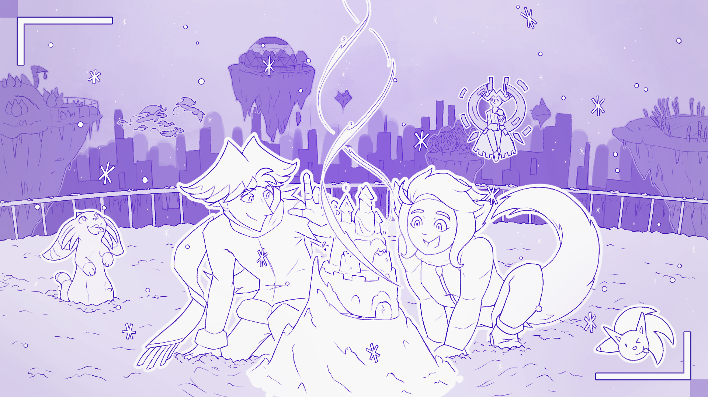

---
humorous:
  - galapagos
  - If I drew my universe like this all of the time, people might be convinced it's a real thing.
  - I swear there are fully-drawn hands under the snow.
  - mycelium park
  - nate
  - the mushroom queendom
tags:
  - alis
  - cattails
  - geodesic dome
  - illustrator
  - lab rats
  - lemongrass
  - neko
  - schnoztrich
  - solana
  - vicerre
---

# Illustration 101 – Snowcastle (2026-01-05 – 2026-01-07, 2026-01-09 – 2026-01-13)

## Overview

Vic uses his ice magic to conjure a castle made of snow for Solana.

## Design notes

- I have been able to use my cumulative learnings in perspective and value to compose a scene of this level of this detail. For this, I am glad.
- This image depicts the first time I have shown the extent of Vic's archipelago.
- Among the islands depicted in this image include:
  - An island where "the mosquito's" giant robot has been repurposed as an artificial reef, surrounded by lemongrass.
  - An island containing a geodesic dome.
  - An island where Vic's experiments in mycelia have been quarantined.
  - An island containing a body of water surrounded by cattails.

## Resources used

- [5 Ways Leadership is Like Building a Sandcastle](https://principalsdesk.org/2017/06/30/5-ways-leadership-is-like-building-a-sandcastle/)
- [Child in a frog pose. Girl child posing in a frog pose in the park. Child on the playground. Selective focus](https://www.dreamstime.com/girl-child-posing-frog-pose-park-child-playground-selective-focus-child-frog-pose-image158657399)
- [Yellow Morel (Morchella esculenta)](https://www.out-grow.com/products/yellow-morel-morchella-esculenta)

## WIPs

- [1](assets/2026-01-06_image-388.png)
