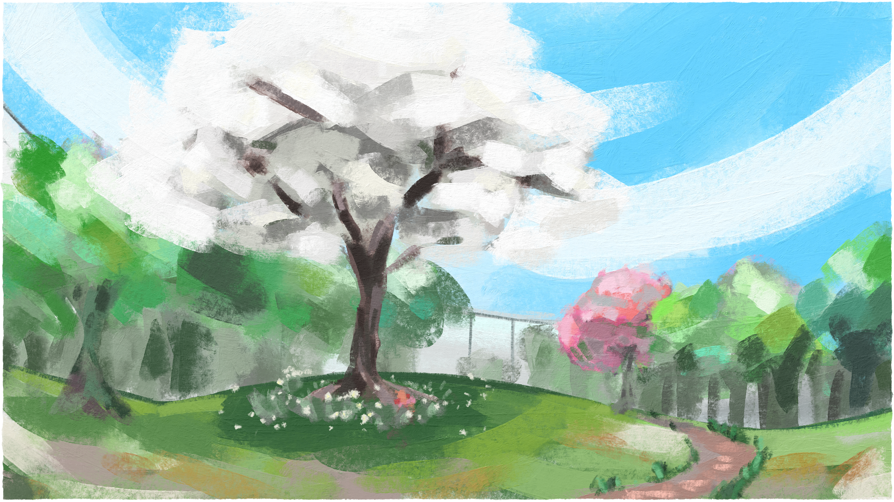

---
tags:
  - concept art
  - environment art
  - headscape
  - labyrinth walking
---

# Illustration 103 – Headscape (2026-01-28)

## Overview

This image depicts concept art of Alis's Headscape as it appears recently.

## Design notes

Differences in Alis's Headscape:

| Element              | Before                   | After                                                             |
| -------------------- | ------------------------ | ----------------------------------------------------------------- |
| Perimeter – material | dark steel               | light aluminium                                                   |
| Perimeter – layout   | maze                     | labyrinth                                                         |
| Center – season      | winter                   | spring                                                            |
| Center – environs    | snow and dormant trees   | grass and blooming trees                                          |
| Center – features    | dormant central magnolia | blooming central magnolia + secondary cherry + tertiary edelweiss |

Flower symbolism:

| Flower    | Character       |
| --------- | --------------- |
| cherry    | Vic             |
| edelweiss | Alis            |
| magnolia  | Armin (Firenze) |

In addition:

- In contrast to steel, aluminium is a metal with lower density. The change from steel to aluminium in Alis's Headscape represents the weight that has been lifted from his shoulders.
- The secondary cherry tree symbolizes the influence of Vic and Solana on Alis's mental state.

## Resources used

- [Central Park](https://www.newyorkbyrail.com/local-guide/central-park-nyc/)
- [edelweiss](https://www.britannica.com/plant/edelweiss-plant)
- [Free Blooming Pink Tree Image](https://stockcake.com/i/_412253_446382)
- [How to Design and Build a Garden Path](https://www.ehow.com/13779119/creating-garden-pathways-to-a-hidden-escape)
- [Leaning Tower of Pisa](https://www.britannica.com/topic/Leaning-Tower-of-Pisa)
