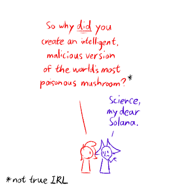
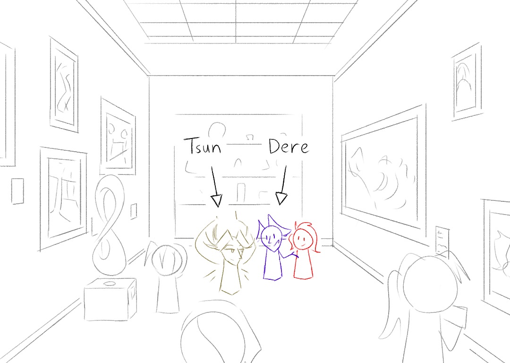
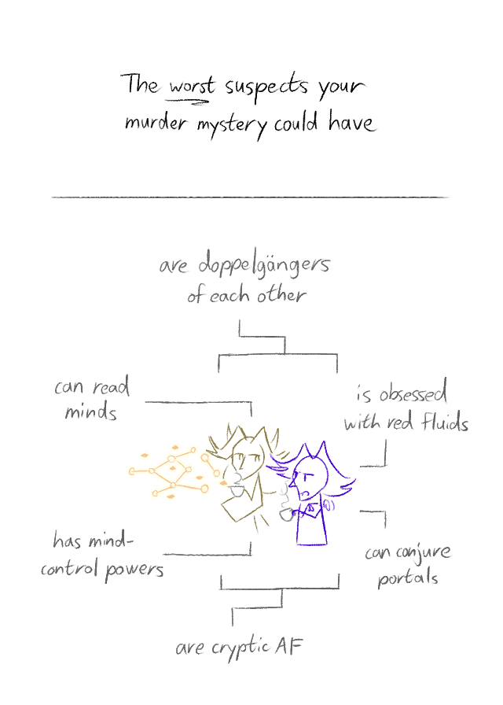
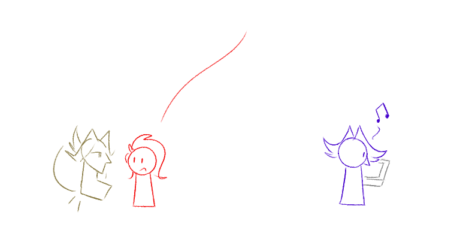

---
tags:
  - alis
  - "Phoenix Wright: Ace Attorney"
  - solana
  - vicerre
---

# Doodle 082 – A Logical Course of Action (2026-01-10)

# Doodle 083 – Tsundere (2026-01-19)

# Doodle 084 – Suspicious (2026-02-02)

<!--
- Caption: The worst characters your murder mystery could have
- Caption: (to Alis and Vic) are doppelgängers of each other
- Caption: (to Alis) can read minds
- Caption: (to Vic) is obsessed with red fluids
- Caption: (to Alis) has mind-control powers
- Caption: (to Vic) can conjure portals
- Caption: (to Alis and Vic) are cryptic AF
-->

# Doodle 085 – I'm Starting to Suspect My Roommate's Fondness for Curling is 100% Non-Ironic (2026-02-09)

[non-canon]

## Overview

Doodle 084:

- Vic would absolutely implicate himself the same way pet owners stick peanut butter inside of dog toys—it provides the detective extra enrichment as they go around piecing things together.

## Resources used

- [Albert Bierstadt | Farallon Island](https://collection.carnegieart.org/objects/11e4cb25-0960-4ca8-b9f6-bd1fbf192a59)
- [Sudowooper](https://www.trsrockin.xyz/fakepokemon.html)
