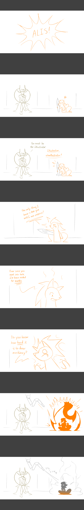

---
humorous:
  - Please keep all fiery outbursts outside the lab.
tags:
  - alis
  - illustrator
---

# Doodle 091 – My Current Experience Figuring Out What the Capacitor Looks Like (2026-05-16)

## Overview

- Statement 1: Drawing geometry in true perspective is hard.
- Statement 2: Circles are hard to freehand.
- Statement 3: Alis's capacitor is, essentially, a giant 3D circle.
- Conclusion: Alis's capacitor is hard to draw.
