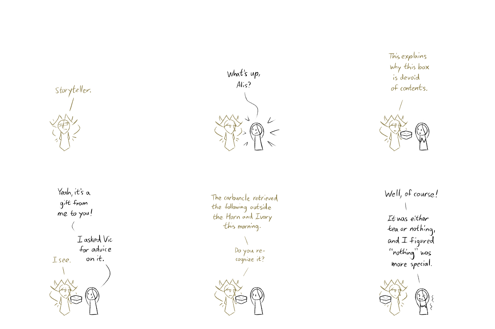
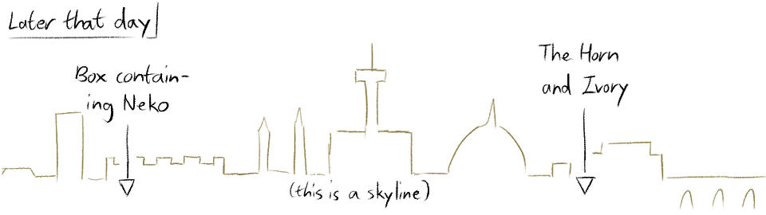
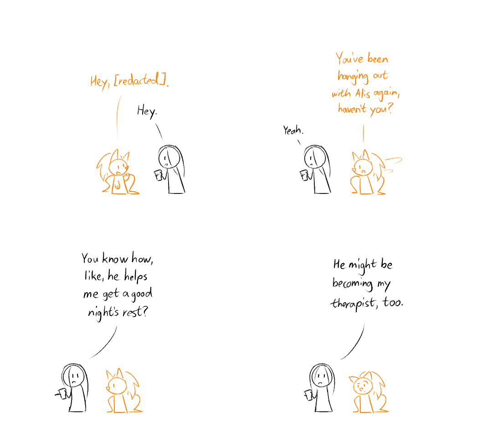

---
humorous:
  - For the man who has everything, give him the thought that counts.
  - "Please keep all fiery outbursts outside the lab."
  - "You're hard to gift for, not gonna lie."
tags:
  - alis
  - fir trees
  - horseshoe crab
  - neko
  - recipe
  - Stetson hat
  - storyteller
  - vicerre
---

# Doodle 092 – Inbox Zero (2026-05-12)

# Doodle 093 – Mecha Art (2026-05-16)

<!--
Illustrator: _Alis!_

Alis: You must be the Illustrator.

Illustrator: Illustrator, schmillustrator!

Illustrator: The only thing I know is that you and I are enemies!

Alis: Is that so?

Illustrator: Ever since you went into tech, I've been stalled for _months_.

Illustrator: Do you know how _hard_ it is to draw machinery?

Illustrator: AAAAAAAAUGH

Robot arm: FSSSSSHH
-->

# Doodle 094 – Chocolate Mousse (2026-05-19)

[non-canon]

# Doodle 095 – Regularly-Scheduled Visits (2026-06-01)

## Overview

n/a

## Design notes

Doodle 092:

- The Storyteller is becoming quite fond of Alis.
- Alis is the type of character who ignores gifts unless they have a practical purpose. However, he still appreciates the sentiment of receiving a gift. These two factors combined leads to "nothing" being perfectly acceptable gift to him.

## Resources used

- [Florence Italy Skyline – lovely wall mural – Photowall](https://www.photowall.com/us/florence-italy-skyline-wallpaper)
- [Stetson Powder River 4X Buffalo Fur Felt Hat ](https://www.bootbarn.com/096B41.html)
- [Universal Robots UR20 Collaborative Robot Arm](https://vention.io/parts/2253)
