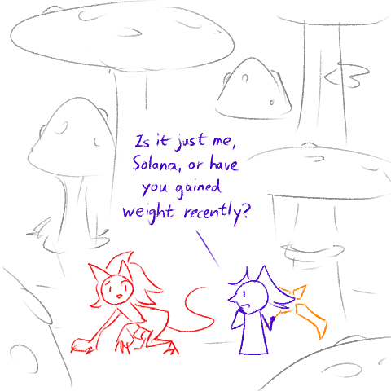
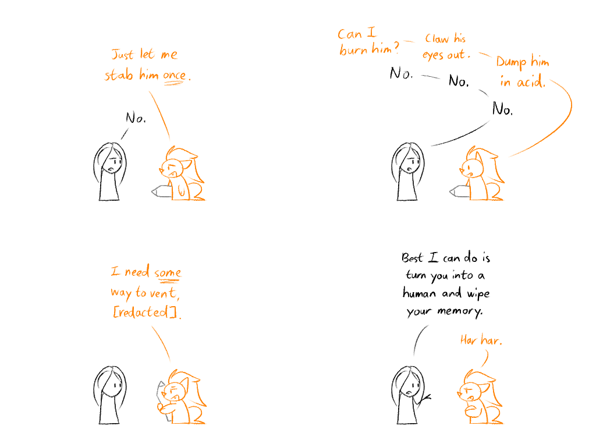
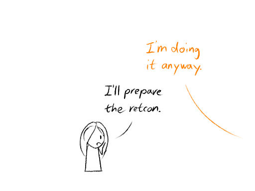

---
tags:
  - illustrator
  - solana
  - storyteller
  - vicerre
---

# Doodle 097 – Pack on the Pounds (2026-06-06)

# Doodle 098 – Art Vent (2026-06-29)

<!--
- Illustrator: Just let me stab him _once_. / Storyteller: No.
- Illustrator: Can I burn him? / Storyteller: No. / Illustrator: Claw his eyes out. / Storyteller: No. / Illustrator: Dump him in acid. / Storyteller: No.
- Illustrator: I need _some_ way to vent, [redacted].
- Storyteller: Best I can do is turn you into a human and wipe your memory. / Illustrator: Har har.
- Illustrator: I'm doing it anyway. / Storyteller: I'll prepare the retcon.
-->

## Overview

Doodle 097: Solana and Vic enjoy a reprieve while installed on A-I-4.
