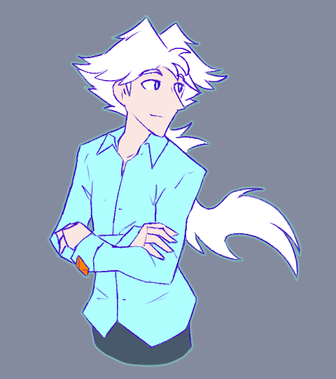

---
humorous:
  - "Oh no, it's hot."
tags:
  - vicerre
---

# Illustration 107 – Dress Shirt (2026-07-03)

## Overview

A casual, summery design for Vic.

## Design notes

- Originally, the use of cyan as the primary color for his shirt was a placeholder until I could figure out a more appropriate color. In the end, I stuck with cyan, as I thought it looked appropriately refreshing.
- This illustration highlights the use of cyan/blue as a theme color on Vic.
- Vic never needed a summer outfit previously since his cryonic abilities functioned as a built-in cooling system.

<!--
- If Vic were ever to have his cryonic abilities restored, I would draw him in a less icy color.
-->
