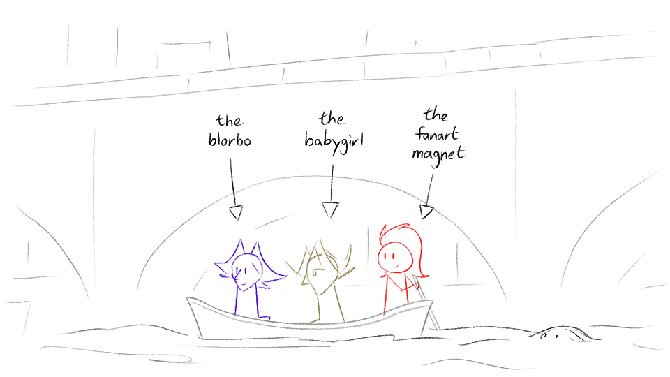
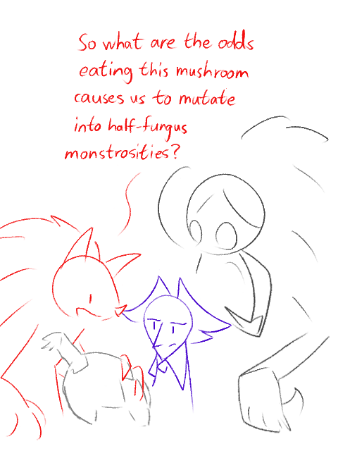
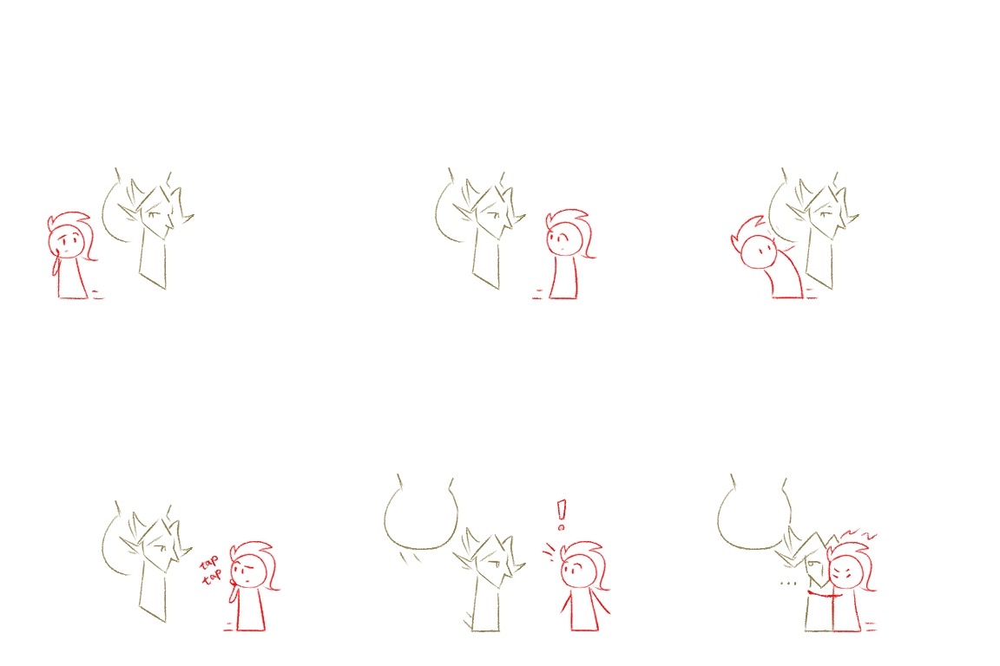

---
humorous:
  - I boat it.
  - I'm on a boat.
  - nom fungible tokens
tags:
  - alis
  - babygirl
  - blorbo
  - fanart magnet
  - fanspeak
  - hive mind
  - hug
  - solana
  - vicerre
---

# Doodle 099 – Barchetto (2026-07-12)

# Doodle 100 – Pine Cone (2026-07-18)

# Doodle 101 – Huggability 2 (2026-07-23)

<!--
Verb options:

- dismantle
- dissolve
- destroy
- deconstruct
- unmake
- unravel
-->

## Design notes

Doodle 099:

- Solana is the person rowing the barchetto as she is the most physically fit of the cast.
- The way Vic and Alis are positioned suggests an [Old-Fashioned Rowboat Date](https://tvtropes.org/pmwiki/pmwiki.php/Main/OldFashionedRowboatDate).
- The Storyteller is stalking her characters using a river of ink.

## Resources used

Doodle 099:

- [Florence River Cruise on a Traditional Barchetto](https://www.viator.com/tours/Florence/-/d519-5049ARNO)
