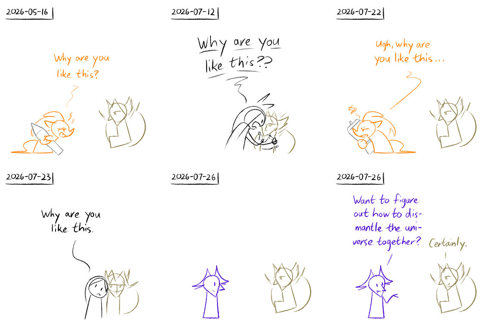
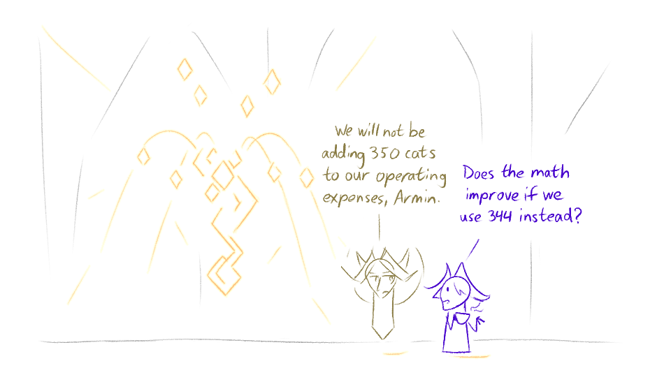
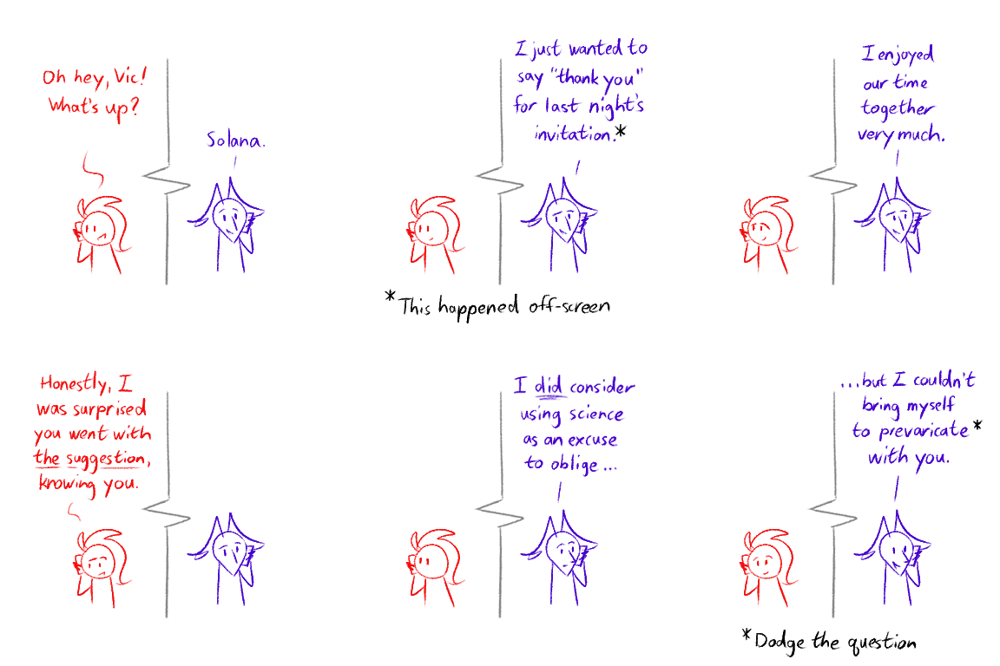
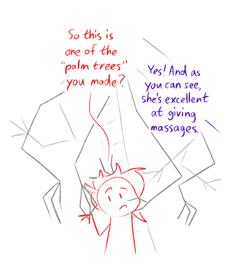

---
humorous:
  - Alis is indeed trouble amirite
  - Babysitting the overdeities of your universe can be such a bother.
  - #JustMadScientistThings
  - "...So long as you leave within 10 minutes."
  - this is the good ending
tags:
  - alis
  - blender
  - cats
  - illustrator
  - solana
  - storyteller
  - vicerre
---

# Doodle 102 – As Of Late (2026-07-25)

# Doodle 103 – Clowderhead (2026-07-28)

# Doodle 104 – Spaghetti Spice (2026-08-09)

# Doodle 105 – Palm Tree (2026-08-16)

## Design notes

Doodle 102:

- This drawing is not intended as a commentary on the rejection-identification model.

Doodle 103:

Context:

- Cats have roughly 249,830,000 neurons in their nervous system.
- Humans have roughly 86,000,000,000 neurons in their nervous systems.
- In order to approximate the intellectual capacity of a human, you would need 344 cats.
- Therefore, creating a hive mind of 344 cats would allow one to approximate the intellect of a human.

In addition, the elaborate shape in the main chamber of the Horn and Ivory is an abstracted spinal cord.

## Resources used

Doodle 102:

- [2026-05-16](../2026-h1/2026-05-16_doodle-091_capacitor-experience.md) (difficulty with drawing)
-  [2026-07-12](https://discord.com/channels/1211610899266281544/1213247576946507859/1526040249430577172) (defense mechanisms)
- [2026-07-22](https://discord.com/channels/1211610899266281544/1213247576946507859/1528882117906534440) (3D printing)
- 2026-07-23 (confidence/control freak)

Doodle 103:

- [List of animals by number of neurons](https://en.wikipedia.org/wiki/List_of_animals_by_number_of_neurons)
