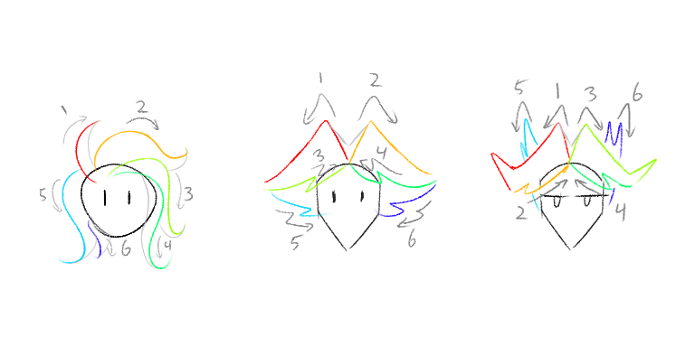

---
tags:
  - alis
  - solana
  - vicerre
---

# Evergreen 006 – Miscellaneous Character Supporting Information

Last update: 2025-06-26

## Dimensions

| Dimension               | Alis       | Solana     | Vic        |
| ----------------------- | ---------- | ---------- | ---------- |
| Age (years)             | 21         | 25 – 26    | 30         |
| Core color (hex code)   | #194C33    | #F30C0C    | #4400CC    |
| Height (imperial units) | 6'0"       | 5'6"       | 5'10"      |
| Numerology              | 157        | 628        | 493        |
| Pronouns                | he/him     | she/her    | he/him     |
| Solidified on           | 2023-06-14 | 2024-02-09 | 2022-10-18 |

## Palettes

## Media character comparisons

| Character | Personality     | Role            | Visual Design |
| --------- | --------------- | --------------- | ------------- |
| Alis      | Miles Edgeworth | Takuto Maruki   | Seto Kaiba    |
| Solana    | Paprika?        | Kurisu Makise?  | Holo?         |
| Vic       | Laios Touden?   | Herschel Layton | Fourth Doctor |

## Hair How-To

