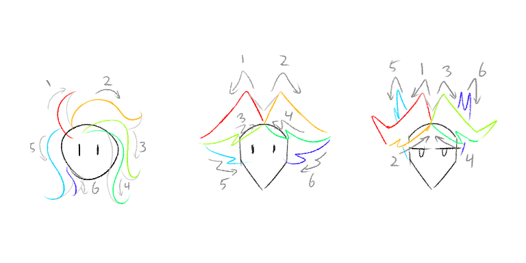

---
tags:
  - alis
  - solana
  - vicerre
---

# Evergreen 006 – Miscellaneous Character Supporting Information

Last update: 2026-01-16

## Dimensions

| Dimension                  | Alis                 | Solana            | Vic                       |
|----------------------------|----------------------|-------------------|---------------------------|
| Age (years)                | 21                   | 25 – 26           | 30 – 31                   |
| Birthdate (est.)           | 2005-01 – 2005-02    | 2000-06 | 1995-04, 1995-09          |
| Character type, originally | literary | role-play | role-play                 |
| Core color (hex code)      | #194C33              | #F30C0C           | #4400CC                   |
| Cultural framing           | eastern              | western     | international                          |
| Height (imperial units)    | 6'0"                 | 5'6"              | 5'10"                     |
| Numerology                 | 157                  | 628               | 493                       |
| Pronouns                   | he/him               | she/her           | he/him                    |
| Real-world catalyst        | optical illusions    | video game avatars | _Find the Constellations_ |
| Solidified on              | 2023-06-14           | 2024-02-09        | 2022-10-18                |

## Palettes

## Media character touchstones

| Character | Personality     | Role            | Visual Design |
| --------- | --------------- |-----------------| ------------- |
| Alis      | Miles Edgeworth | Takuto Maruki   | Seto Kaiba    |
| Solana    | Paprika?        | Kurisu Makise?  | Holo?         |
| Vic       | Laios Touden?   | Michael Stevens | Fourth Doctor |

<!--
- Herschel Layton?
- The Architect?
-->

## Hair How-To

