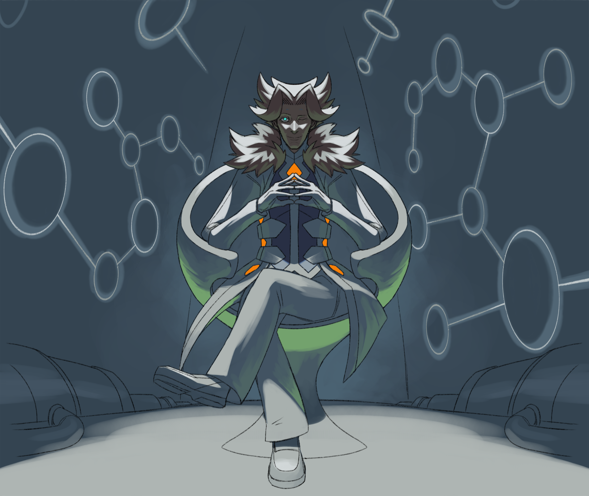

---
tags:
  - alis
---

# Fanart 052

- Artist: Yokaiju
- Cost: £60
- Subject: Alis
- Type: commission

Prompt:

> - Atmosphere: He should convey a psychologically dominant atmosphere and look more tense than relaxed. He should exude a sinister presence but not to the extent of a full-on edgelord. Overall, he should look cool.
> - Background (rough): Sci-fi anime research labs with off-white and/or steel blue paneling.
> - Composition: Drawn symmetrically from the front, with the camera either straight-on or Dutch angle tilt. Don't use low- nor high-angle shots.
> - Lighting direction: Intense overhead lighting or a single spotlight with the rest of the scene in darkness ([example](https://twitter.com/serpentlingrimm/status/1773411135082958874). At least half of his figure should be cast into shadow, with either top-down lighting casting his lower half into shadow or lighting from behind casting his front into shadow. The lighting should be high-contrast—not soft but not black and white. Pair this light with a dirty green or clean blue rim light.
> - Lighting temperature: Stark fluorescent white, not a natural, warm yellow.
> - Pose: He should sit on a clean, white, sci-fi looking chair. His finger should be interleaved. One ehe should be open and aloof, peering somewhat intensely at the camera with a subtle "I'm in control of this situation" smirk ([example](https://www.youtube.com/watch?v=nBy4Ir_Pfng)). Fold one leg over the knee.

## WIPs

- [1](assets/2025-01-14_fanimage-082.png)
- [2](assets/2025-01-16_fanimage-083.png)
