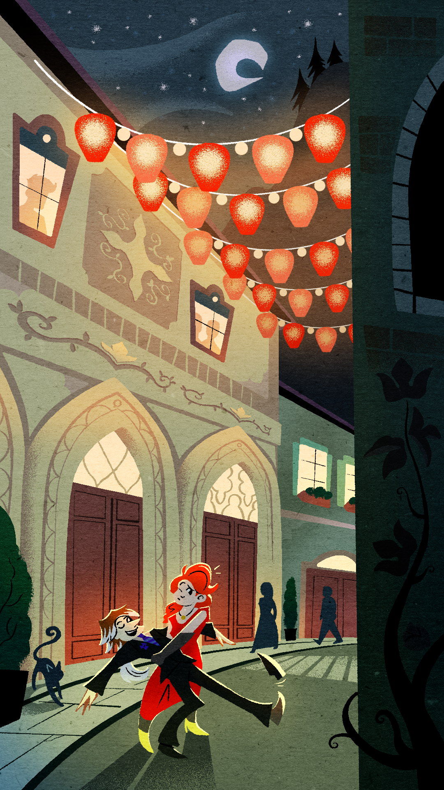

---
tags:
  - solana
  - vicerre
---

# Fanart 065

- Artist: StephXPM
- Cost: $135 USD
- Subject: Solana, Vicerre
- Type: commission

Ideas:

- Solana and Vic try to tango in the streets of Firenze. Both of them don't actually know how to dance, so it becomes an awkward-yet-cute learning experience. In this scenario, both of them have classier outfits than their usual outfits.
- Solana and Vic figure out the best way for Vic to give her a smooch as Vic has that nose of his in the way. After a degree of trial and error, they settle for a nose kiss. This idea is executed best using a structure with multiple panels.
- Solana pounced on Vic like a predator having caught its prey. She has fox-like claws extended and is awfully playful with Vic, perhaps using her tails to tease him.

Prompt:

> - Environment: Consider including Florentine villas and piazzas ([1](https://www.villaflorentine.com/en/), [2](https://www.walksofitaly.com/blog/things-to-do/italian-piazzas)). Consider including a river and bridges crossing it. Consider using goldenrod hues, but don't be beholden to this imagery ([example](https://www.pinterest.com/pin/8655424280119818/)). Google Street View in Florence, Italy should suit this environment well.
> - Lighting: Consider depicting the scene at night and illuminated by lamps.
> - Outfits, overall: Dress them in classic tango dresswear.
> - Outfits, Solana: A clean, full-length, unprovocative red dress. Include yellow adornments. Consider including black opera gloves and stockings.
> - Outfits, Vic: A standard black two-piece suit with a blue-purple pattern on the tie. Vic's hair should be cleaned up somewhat but still frumpy. Consider including a boutonnière.

## WIPs

- [1](assets/2025-02-18_fanimage-101.png)
- [2](assets/2025-02-19_fanimage-102.png)
- [3](assets/2025-02-19_fanimage-103.png)
- [4](assets/2025-03-03_fanimage-113.png)
- [5](assets/2025-03-03_fanimage-114.png)
