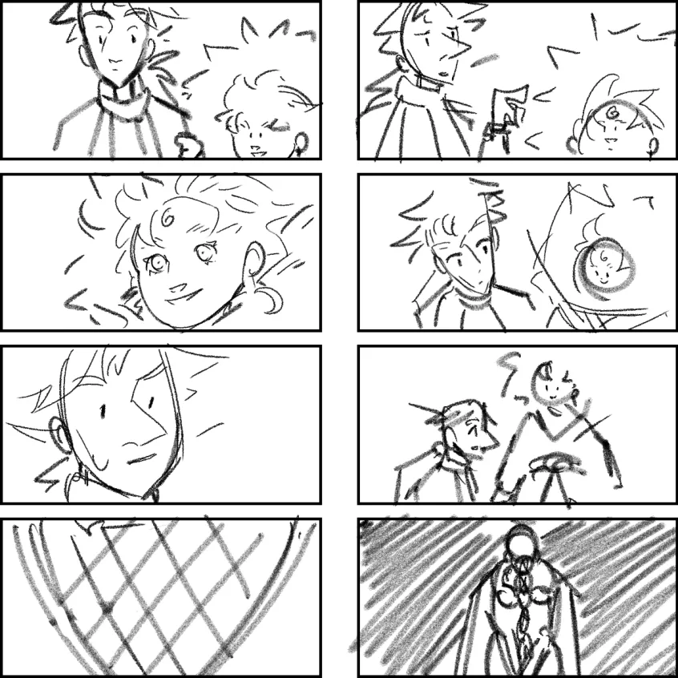
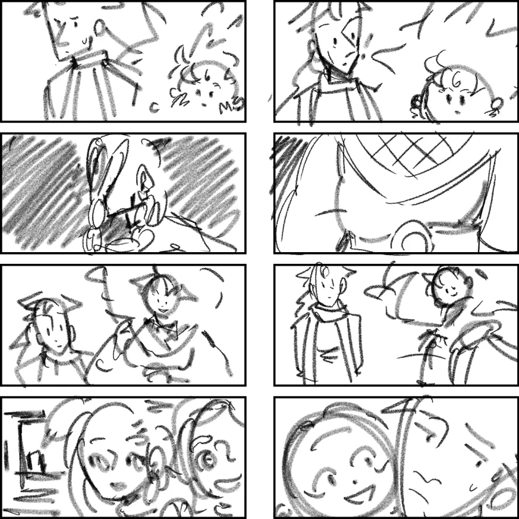

---
tags:
  - alis
  - chu
  - ishikawa
  - mari
  - solana
  - vicerre
  - yatu
---

# Fanart 067

- Artist: Kiwi
- Subject: Alis, Kiwi, Vicerre
- Type: gift art

Artist's comment:

> 1. Ice guy: _Hi Vic_
> 2. Vic: Responds, a little confused – he was expecting the Storyteller of this 'verse
> 3. Ice guy: _He's in my cloak. I'm [name] by the way. Ice and fire guy, like you and your girlfriend_
> 4. Storyteller: _Sorry the uhh... Illustrator here wasn't picking up my calls_
> 5. Vic: _Right..._
> 6. Storyteller: _Well, I'm really glad to meet you, but I've sortof already met you a couple of times._
> 7. Storyteller: _I think we need to discuss... that thing_
> 8. Storyteller: _Ruh_

> 1. Storyteller: _She used to be the minister of storytelling, say, another storyteller_
> 2. _But you've inspired me to move her into a different role_
> 3. _Ruh is no longer delegated to non-canon storytelling. She can only oversee the canon_
> 4. _Your presence – the non-canon – is now under my protection and oversight_
> 5. _She's not going to apologise, that is the truth in all honesty, and like Ishi, I like being honest._
>    Ice guy mutters: Do you have any clue what you look like in there?
> 6. _But I sincerely apologise, and want to nod you to something important, if you will_
>
> 7. _Chu and Solana shopping_
> 8. _Mari, well, harassing Alis, but I think it's cute_

> 1. _And lastly, Ishi. Remember that time you took his DNA sample?_
> 2. _You're the reason he..._
